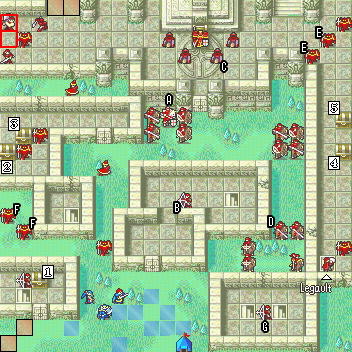
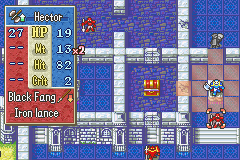

Fire emblem is a popular strategy game. There are currently 16 games in the franchise and I've played the majority of them. For those unfamiliar you have a roster of interesting characters that act on a field with a grid. On that grid there is an enemy army, one you're tasked with defeating. It has objectives like defeating the boss, routing the entire enemy force, or defending a point from waves of reinforcements.



Of course, from this one can assume combat plays a large role and you'd be right. Combat works like so: you take your plucky protagonist prince Marth and move him within attacking range of an enemy unit. You select attack from the menu and go from there. You and the enemy are different though! You have, depending on the game, the following stats: Health Points (HP), Strength (Str), Magic (Mag), Skill (Skl), Speed (Spd), Luck (Luk), Defense (Def), and Resistance (Res). You have a weapon with its own stats like its attack and hit rate. All of these numbers between you and the enemy are taken into consideration and you're presented with a battle forecast! 



Let's continue with our example with Marth. Let's say he wants to fight an enemy Bandit and the forecast shows you that Marth has an 80% chance to hit and the enemy bandit has a 30% chance to retaliate. What if I told you though that, depending on the fire emblem game, those numbers may not be accurate? 

To explain let me first start with the older fire emblem games (1 through 5). These games were honest, an 80% was in fact an 80%. The game would roll an integer between 0 and 99 and if the integer rolled was less than the hit-rate you were shown, then congratulations, you landed a hit. That system, though one I prefer, proved to be problematic for the wider fan base. See, people are very bad at gauging probability. For example, a 95% hit rate might seem incredibly reliable, but one in twenty times you're gonna miss. When you're engaging in as much combat as there is in this game those odds are going to work against you eventually. You can find many players that have missed a 90%+ hit only to be struck down by a 10% hit or less from the enemy. For many players that experience is frustrating. This is where we get into the little white lies of the later games in the franchise. 


Starting with Fire Emblem: The Binding Blade on the game boy advance the games started to employ a 2 random number system for the hit rates. What does that mean? Well, instead of rolling one integer value the game now rolls two of them and takes the average. If that average value is less than the hit rate than you land the hit. The question we really need to ask is why does that change anything? 

The central limit theorem explains this little white lie perfectly. 

---

**Central Limit Theorem**

Let $X_1, X_2, ... , X_n$ be a random sample from a distribution with mean $\mu$ and variance $\sigma^2$. Then if $n$ is sufficiently large, $\overline{X}$ has approximately a normal distribution with $\mu_x = \mu$ and $(\sigma_{\overline{x}})^2 = \frac{\sigma^2}{n}$. The larger the value of $n$, the better the approximation. 

\- Jay L. Devore, Probability and Statistics for Engineering and the Sciences 8th Edition

---

In not silly nonsense words this means that, regardless of the distribution that we're starting with, if we're working with the averages of a sample we will end up with a normal distribution given a large enough number of trials. So, to put this into context, what we're starting with is a uniform distribution. Every number between 0 and 99 has the same chance of being selected. The averages though don't. Just think about it, it makes sense to think that those averages are typically going to end up around 50 yeah? If one integer was 1 and the other 99 you get $1 + 99 = 100$ and $100 / 2 = 50$.  Those two extreme integer values still average to 50! To actually hit a 1% chance hit rate you'd need to roll **two** zeroes. That's some low odds. This is definitely going to have some implications for what your hit rates in Fire Emblem actually are. 

Below I have some code that serves a nice purpose. It takes in a hit rate and returns what the fans refer to as the "true hit". I can showcase just how drastic these differences get easily here.

```{r}
two_rn_calc <- function(hit_rate) {
  retval <- c()
  
  for (i in 1:5000) {
    x <- sample(0:99, size = 2)
    y <- round( (x[1] + x[2]) / 2 )
    
    if (y < hit_rate) {retval <- append(retval, 1)}
    
    else {retval <- append(retval, 0)}
  }
  
  z <- sum(retval) / length(retval) * 100
  return(paste("The true hit rate is: ", z, "%"))
}
```

Now that we have our function let's test it on different hit rates! Let's start with 50.

```{r}
two_rn_calc(50)
```

What we can see here is that our true hit rate is right around 50, which is to be expected. It's not exact because there's still some randomness here, but it is very close. What if we were to use a lower value though, like 25?

```{r}
two_rn_calc(25)
```
What we get is a true hit that is significantly lower than the displayed hit rate. That is a huge difference! We'll see the same with a higher value, like 75, but in the other direction. 

```{r}
two_rn_calc(75)
```

If it still doesn't make sense why maybe it will once I show you a plot of what's happening under the hood. Let's modify our code a little bit! We want to look at the values of 'y', the average of our two random numbers, over 5000 different trials and plot them!  

```{r}
plot_vector <- c()

for (i in 1:5000) {
  x <- sample(0:99, size = 2)
  y <- round( (x[1] + x[2]) / 2 )
  plot_vector <- append(plot_vector, y)
}
```

```{r}
library(webshot)
df <- plot_vector |> as.data.frame()
ggplot2::ggplot(df, ggplot2::aes(x = plot_vector, y = ..count../sum(..count..) * 100)) +
  ggplot2::geom_histogram(bins = 50, colour = "grey", fill = "black") +
  ggplot2::labs(x = "Average", y = "Relative Frequency (%)")
```

This plot shows us what we expected, a bell curve. I had the plot show the relative frequency because it paints a nice picture. When calculating a true hit there is something to keep in mind, the probability is cumulative. So, just because the values around 50 are at the 4% mark does not mean a 50% hit rate has a 4% chance to hit. You would add up everything before it as well! Remember, you just need the average to be **lower** than the displayed hit rate.

To see this in action I have a cumulative probability plot. Notice how much lower the true hit is when the displayed hit is 25. Notice as well the true hit when the displayed hit is 75. 

```{r}
ggplot2::ggplot(df, ggplot2::aes(x = plot_vector)) +
  ggplot2::stat_ecdf(geom = "step") +
  ggplot2::labs(x = "Displayed Hit", y = "True Hit") 
```

So, why would a game do this? Is it a bad thing that a strategy game of all things lies to the player about such critical information? Personally, it isn't my preference but I can absolutely see why they do it. What this does is make the hit rates act like they feel to someone not entrenched in probability. A 95%, to a player, should absolutely be a safe bet. So they inflate the number higher to make it more likely. Enemies also tend to have lower hit rates, so if you can get them below 50% hit rate than you benefit tremendously. The game may be lying to you, but this system primarily benefits the player. It does have some balancing issues though, so some later games like Fire Emblem Fates use a 2RN system for hit rates above 50 but stick to a 1RN system for those lower than 50% to prevent the player from completely negating the risk they face against those lower enemy hit rates. 

Anyway, that was a look into how a strategy game has been lying to its player base for over a decade! I hope you found that informative, and, if not, I hope you at least had a good reason to stick around. 