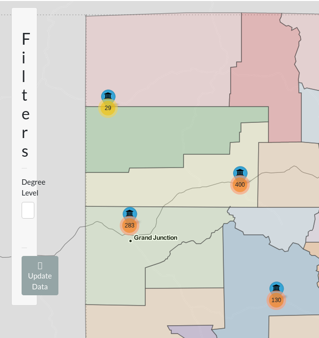
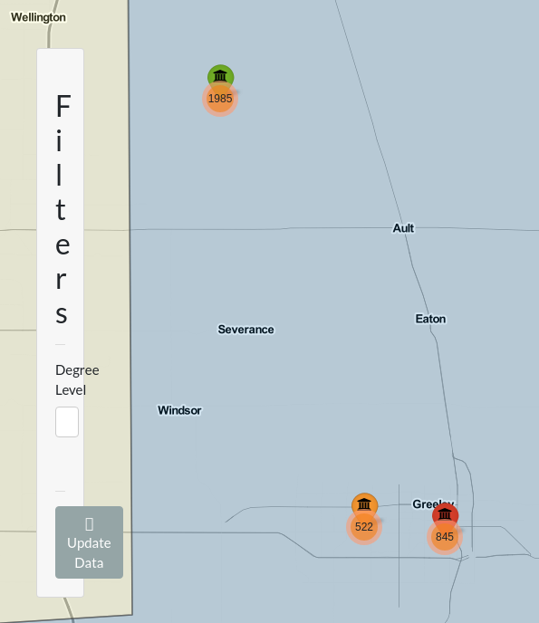

I'm currently working on a shiny application as a personal project alongside a fellow club officer. The app we're using uses a [data-set](https://data.colorado.gov/Higher-Education/Degrees-Awarded-to-Post-Secondary-Graduates-in-Col/hxf8-ab6k) containing information about post-secondary degrees awarded in Colorado. It contains a variety of demographic information spanning 2001 to 2017, so there's a **lot** of information here. 

My current task has been an interactive map showing where all the universities are. I've got some cool plans for it, so I would like to showcase my progress. I've been using the wonderful [Leaflet](https://leafletjs.com/) package for this and a great guide exists for those using it in [R](https://rstudio.github.io/leaflet/). 

Firstly, I knew I wanted to color the map by county so I had to figure that out. My first attempt, utilizing a lot of code from the original guide, looks as follows. 


```{r}
library(leaflet)
colorado_counties <- 
  maps::map("county", 'colorado', 
            fill = TRUE, 
            col = palette(),
            plot = FALSE
            )

map1 <- leaflet::leaflet(data = colorado_counties) |>
  addTiles() |>
  addPolygons(
    fillColor = topo.colors(64,alpha = 1), 
    stroke = FALSE
    ) |>
  widgetframe::frameableWidget()
```

```{r, echo=TRUE}
widgetframe::frameWidget(map1)
```


There are quite a number of problems with this initial build. First of all is that it's just a little unclear without any county outlines and many of the colors bleed together. There's also no limitation to zooming in and out even though there's no benefit to the end user for doing so. That's okay though! It's a very simple first step. From there I feel as if I've improved it quite a bit. I've added the following changes:

- New colors
- County outlines
- Mouseover highlighting for the map
- Max and minimum zoom
- A new tileset from the ThunderForest package. 
- markers for each of the institutions in our data frame 

```{r}
institution_locations <- readr::read_rds("institution_locations.rds")
colorado_counties <- maps::map("county", 'colorado', fill = TRUE, plot = FALSE)


map2 <- leaflet(data = colorado_counties, 
                  options = leafletOptions(
                    minZoom = 6.25,
                    maxZoom = 12.5)
                  ) |>
  addProviderTiles(providers$Thunderforest.MobileAtlas) |>
  addProviderTiles(providers$Stamen.TonerLines,
                  options = providerTileOptions(opacity = 0.35)) |>
  addProviderTiles(providers$Stamen.TonerLabels) |>
  addMarkers(~institution_locations$long, 
             ~institution_locations$lat, 
             popup = institution_locations$institutionname) |>
  leaflet::addPolygons(
    color = "#444444",
    weight = 1.5,
    smoothFactor = 1,
    fillColor = RColorBrewer::brewer.pal(12, "Paired"),
    stroke = TRUE,
    highlightOptions = highlightOptions(
      stroke = TRUE,
      color = "white",
      weight = 5,
      bringToFront = TRUE)
    )

```

```{r, echo=TRUE}
widgetframe::frameWidget(map2)
```


I still have a ton to do but as of Dec 29th thats where I'm at! I hope to update this more as I get further along. I still need to integrate this with our giant data-set so theres a lot to do. 


## Update: Jan 11

A lot of progress has been made on the map. I have gotten it working with our giant data-set and have modified a number of features. 
I have added:

- A different palette

- Updated marker icons

- Clustering for the awarded degrees, zooming in shows which batch of degrees belong to which school

Not shown here:

- Shiny re-activity has been finally added! In the web application I'm working on you can filter by the degree level, so you can look at only associates degrees for instance. That would be a huge hassle to show here though. 

- The code to setup the data. It wasn't done by me anyway and I don't want this post to be too bogged down by giant batches of code. 

```{r, echo=FALSE}
  options(readr.show_col_types = FALSE)
  data_url <- "https://data.colorado.gov/resource/hxf8-ab6k.csv?$limit=250000"
  location_df <- readRDS("institution_locations.rds")

  #print("Fetching data from url...")

  degrees_data <- data_url |>
    httr::GET() |>
    httr::content()

  #print("Found data!")

  ## Clean/Organize data
  ad_org <- degrees_data |>
    dplyr::arrange(
      year,
      institutionname
    ) |>
    dplyr::filter(
      !is.na(recordcount)
    ) |>
    dplyr::mutate(
      programname = ifelse(
        test = is.na(programname),
        yes = "General",
        no = programname
      )
    ) |>
    dplyr::left_join(location_df, by = "institutionname")

  #print("Data cleaned and ready for use!")
```

```{r}
colorado_counties <- maps::map("county", 'colorado', fill = TRUE, plot = FALSE)

map3 <- leaflet(data = colorado_counties, 
              options = leafletOptions(
                minZoom = 6,
                maxZoom = 18)
      ) |>
        addProviderTiles(providers$Thunderforest.MobileAtlas) |>
        addProviderTiles(providers$Stamen.TonerLines,
                         options = providerTileOptions(opacity = 0.35)) |>
        addProviderTiles(providers$Stamen.TonerLabels) |>
        addMarkers(ad_org$long,
                   ad_org$lat,
                   clusterOptions = markerClusterOptions(spiderfyOnMaxZoom = FALSE)
                   ) |>
        addAwesomeMarkers(lng = unique(ad_org$long),
                   lat = unique(ad_org$lat), 
                   icon = awesomeIcons(icon = 'fa-university', 
                                       markerColor = 'green', 
                                       iconColor = 'black', 
                                       library = "fa"),
                   popup = unique(ad_org$institutionname),
                   options = markerOptions(opacity = .6, 
                                           riseOnHover = TRUE)
                   ) |>
        addPolygons(
          color = "#444444",
          weight = 1.5,
          smoothFactor = 1, 
          fillColor = RColorBrewer::brewer.pal(11, "Spectral"),
          stroke = TRUE,
          highlightOptions = highlightOptions(
            stroke = TRUE,
            color = "white",
            weight = 5,
            bringToFront = TRUE)
        )
```

```{r}
widgetframe::frameWidget(map3)
```

There's still a **LOT** I want to do here. The elephant in the room is how the green markers completely overshadow the orange clusters. That would be fine, except for the fact I want the clusters to be the focus, not the markers. You can't even see the biggest cluster, the one in Denver. 

Unfortunately I've struggled to find a way to make the clusters pop out more, at least with what is built into R. Ideally I could make the circles bigger based on the number of degrees and have them in front of the markers, but I haven't been able to figure out how to accomplish that. I found options [here](https://github.com/Leaflet/Leaflet.markercluster), but I don't know how to implement these in R.

Another thing is that I'd like to make the markers color tied to the number of degrees awarded per school, though that should be easy to accomplish. Regardless, I feel like this is coming along nicely! This is a very fun package to play around with and I can see myself continuing to jump straight to this with future data sets.

## Update: Jan 29th 

School has started back up and I super don't have time to work on this much anymore. I'm still trying about once a week though. I don't have much in the way of updates, though I do have some thoughts.

I'm beginning to reach the point where a lot of the tutorials I rely on are running dry. I'm starting to have to figure stuff out on my own and man am I not succeeding on that front. Here's a list of some exciting bugs I'm running into! 

### The Absolute PITA (panel)
The absolute panel in shiny is a really neat tool. Since my map takes up all of the available real estate there isn't any room for a traditional sidebar. That's where the absolute panel comes in. It can sit above my map, can show input selectors like filters or output like entire plots. You can even drag it around so it doesn't get in the way of anything on the map. It's dope and I desperately want to use it. The problem is it really doesn't want me to.

The first, and biggest, issue with the panel is that I cannot for the life of me satisfy its desires for width. Meet the filter sidebar, it looks like this whether I give it 200 pixels of width or 500. 

```{r, echo=FALSE, out.width="400px"}

```

The only thing that can satisfy its hunger is 1000 pixels of width, which has the neat "feature" of being able to drag it from nearly anywhere on the screen! How convenient. Unfortunately that means you can't interact with much else on the map. A sacrifice the absolute panel will happily make. 

The frustrating thing with anything involving the absolute panel is the lack of documentation. Like, it's [there](https://shiny.rstudio.com/reference/shiny/0.12.1/absolutePanel.html) don't get me wrong, but nothing in the docs seems to help me with my specific problem. I've scoured stackoverflow threads and have tried a variety of their fixes. One such fix involved using the relative CSS units "vw" and "vh". This is nice to know about but, while those are definitely superior means of defining length and width, they do not satisfy the hunger of the primeval beast that is *the panel*. I really do not know where to go with this bug in particular. Hopefully I can resolve it sooner rather than later because, man, does it make using this web application impossible. 

### The Color of Madness

This is less of a bug and more of an issue stemming from my own incompetence. See, I'm considering abandoning the cluster feature. It's really cool but, due to the how few unique latitudes and longitudes there are, isn't as visually interesting as it would typically be with a more varied data set. This is simply a limitation of the data and I want to avoid forcing a tool that I don't think is truly appropriate. 

As an alternative I'm using a method that I have shamelessly taken from the [leaflet for R tutorial](https://rstudio.github.io/leaflet/markers.html). I want to change the colors of the markers based on the relative frequency of degrees awarded there. As an example, locations with low amounts of degrees compared to the total would be colored say, green, where ones with the bulk of degrees might be red. Simple enough one would think. Relative frequency also makes sure I'm not using arbitrary *magic numbers* that are either too strict or too lenient based on how you filter the data. 

The problem isn't calculating the relative frequency. The problem isn't assigning the colors either. The problem is getting them assigned to the right location elegantly. I believe what's happening is that the list of colors I'm generating is just getting recycled through this ungodly large data set and is essentially being assigned at random. Below we have an example where all three colors are wrong! Also say hi to Mr. Panel again, he made getting this screenshot **very** exciting. 

```{r, out.width="400px", echo=FALSE}

```

These are the two big blocking issues I'm facing right now. I'm also experiencing a problem where I want to replace the popups with labels that show up when you hover the mouse over. The labels work perfectly but apparently they don't like to display multi-line information without some, shall we say, motivation. Apparently the fix is to use some HTML code but I don't know how to include the variables I want to include in the HTML. It also doesn't help that the extra information I want to include, like the number of degrees awarded by the school, is being assigned incorrectly just like the colors for the same reason! 

Overall I think Shiny has really taken how I think through R troubleshooting and flipped it on its head. Everything is so *weird* and it makes me doubt my own confidence. Couple that with an inexperience with HTML or CSS which help you sidestep some rakes and you've got yourself someone who experienced a lot of rakes hitting me in the face today. 

It is still really cool though and I know I can get this where I want it to be. Days where I just stumble around and run into walls are useful and I have to remind myself of that constantly. The tutorials and bountiful stackoverflow threads go away as your problems get more niche and I have to get comfortable with this feeling. I'll get there but gosh, this can be exhausting sometimes. 