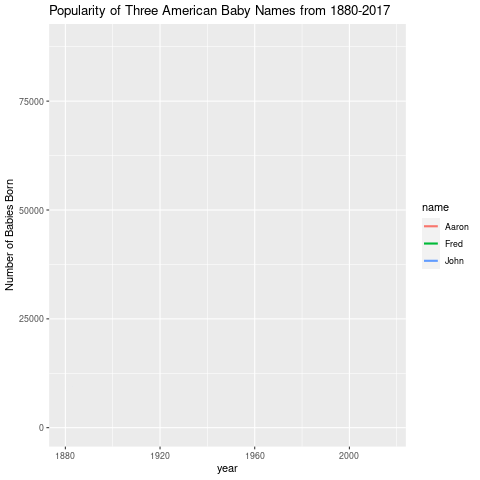
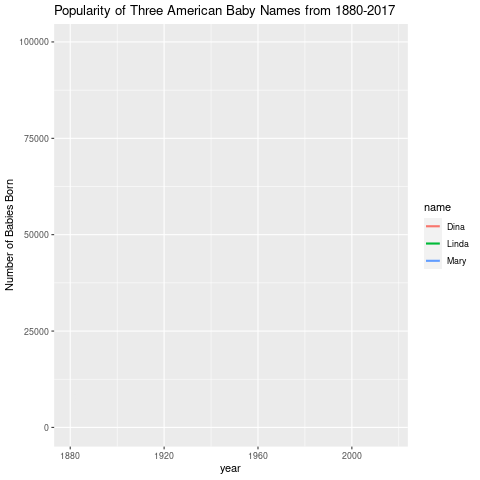
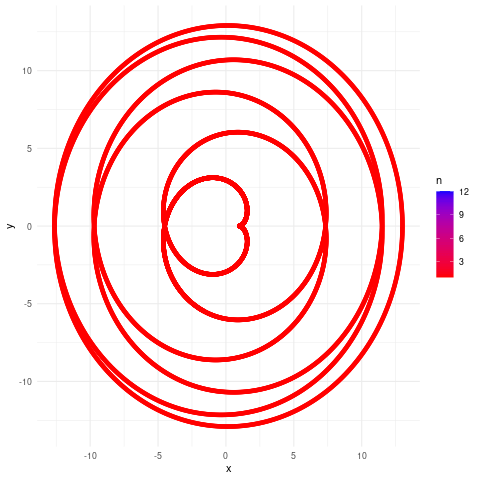

```{r setup, include = FALSE}
library(rmarkdown, tinytex) 
library(ggplot2)
library(gganimate)
library(GGally)
library(gifski)
library(RColorBrewer)
library(viridis)
library(viridisLite)
library(maps)
library(mapproj)
library(wordcloud)
library(gapminder)
library(datasauRus)
library(babynames)
#library(hrbrthemes)
library(scales)
library(lubridate)
```


## Problem 1.
Read in the built-in dataset mtcars. Call library(GGally).

```{r}
data(mtcars)
```

### Problem 1a
Convert the cyl column to a factor
```{r}
mtcars$cyl <- base::as.factor(mtcars$cyl)
```

### Problem 1b
Use ggpairs to create a scatterplot matrix of the dataset. Use only the columns mpg, disp, hp, drat, wt and color by cylinder. 

```{r}
ggpairs(mtcars, aes(col = cyl), columns = c(1, 3, 4, 5, 6))
```


\pagebreak


## Problem 2
For the built-in dataset iris, use ggpairs to create a scatterplot matrix with bar graphs on the diagnal. 

```{r}
data("iris")
```

```{r}
ggpairs(iris, diag = list(continuous = "barDiag"))
```


\pagebreak


## Problem 3
Read in the dataset babynames.

```{r}
dataset <- babynames
head(dataset)
```

### Problem 3a
Pick three male names in the list and draw a static line chart of number of babies born these names vs. year. 

```{r}
three_male_names <- dplyr::filter(dataset, (name == "John" | name == "Fred" | name == "Aaron") & sex == "M")
```

```{r}
ggplot(three_male_names, aes(year, n, color = name)) +
  geom_line(size = 1) +
  ggtitle("Popularity of Three American Baby Names from 1880-2017") +
  ylab("Number of Babies Born")
```

### Problem 3b

```{r}
# anim <- ggplot(three_male_names, aes(year, n, color = name)) +
#   geom_line(size = 1) +
#   ggtitle("Popularity of Three American Baby Names from 1880-2017") +
#   ylab("Number of Babies Born") +
#   transition_reveal(year)
# 
# gganimate::anim_save("ani1.gif", anim)
```
Note: Code is incredibly slow so it's commented out.


### Problem 3c
Pick three female names in the list and draw a static line chart of number of babies born with these names vs. year.

```{r}
three_female_names <- dplyr::filter(dataset, (name == "Linda" | name == "Dina" | name == "Mary") & sex == "F")
```

```{r}
ggplot(three_female_names, aes(year, n, color = name)) +
  geom_line(size = 1) +
  ggtitle("Popularity of Three American Baby Names from 1880-2017") +
  ylab("Number of Babies Born")
```

### Problem 3d

```{r}
# ani2 <- ggplot(three_female_names, aes(year, n, color = name)) +
#   geom_line(size = 1) +
#   ggtitle("Popularity of Three American Baby Names from 1880-2017") +
#   ylab("Number of Babies Born") +
#   transition_reveal(year)
# 
# gganimate::anim_save("ani2.gif", ani2)
```


\pagebreak


## Problem 4
Create a wordcloud. Use at least 100 words. You can create a shorter list and repeat it.
Show your word and frequency vectors. (Use fig.asp = 1.)

```{r}
ex_vector <- stringr::words[seq(1, 980, by=9)]
ex_vector
```

```{r}
set.seed(791)
par(bg="black")
wordcloud(ex_vector, seq(1, 109), 
          scale = c(1.7, 0.2),
          colors = brewer.pal(8, "Dark2"))
```


\pagebreak

## Problem 5
Read in the file USCovidState.csv

```{r}
USCovid <- "USCovidStates.csv" %>%
  readr::read_csv()
```

### Problem 5a
Use ggplot to create a bar graph of the cumulative number of cases by state. To fit all the states on the x labels, use angle = 90. This is a vertical bar graph.

```{r}
ggplot(USCovid, aes(x=state, y=cases)) +
  geom_col() +
  theme(axis.text.x = element_text(angle = 90)) +
  scale_y_continuous(labels = comma) +
  ggtitle("Cumulative Covid19 Cases by State")
```

### Problem 5b
Use ggplot to create a lollipop chart of the cumulative number of cases by state. To fit all the states on the x labels, use angle = 90. This is a vertical lollipop chart.

```{r}
ggplot(USCovid, aes(x = state, y = cases)) +
  geom_point(size=3) +
  geom_segment(x = USCovid$state, xend = USCovid$state, y = 0, yend = USCovid$cases) +
  theme(axis.text.x = element_text(angle = 90)) +
  scale_y_continuous(labels = comma) +
  ggtitle("Cumulative Covid19 Cases by State")
```

### Problem 5c
Flip both the bar graph and the lollipop chart to horizontal. Adjust fig.asp so that it is readable. Adjust the data so that the state names read alphabetically top down.

```{r}
# Reorder names in alphabetical order from top-to-bottom
USCovid$state <- forcats::fct_rev(factor(USCovid$state))

ggplot(USCovid, aes(y=state, x=cases)) +
  geom_col() +
  scale_x_continuous(labels = comma) +
  ggtitle("Cumulative Covid19 Cases by State")
```

```{r}
ggplot(USCovid, aes(y = state, x = cases)) +
  geom_point(size=3) +
  geom_segment(y = USCovid$state, yend = USCovid$state, x = 0, xend = USCovid$cases) +
  # theme(axis.text.x = element_text(angle = 90)) +
  scale_x_continuous(labels = comma) +
  ggtitle("Cumulative Covid19 Cases by State")
```


### Problem 5d
Create a percentile US map for the cumulative number of cases by state. 

```{r}
# Re-read in the data for ease of manipulation
USCovid <- "USCovidStates.csv" %>%
  readr::read_csv()

# Cut dataset into percentiles
quant <- stats::quantile(USCovid$cases, c(0, 0.2, 0.4, 0.6, 0.8, 1.0))

USCovid$cases_q <- cut(USCovid$cases, quant, 
                       labels = c("0-20%", "20-40%", "40-60%", "60-80%", "80-100%"),
                       include.lowest = TRUE)
# The above code is so much more elegant than the nonsense solution I came up with for this. That's what I get for only skimming the lab notes! 

# Convert state names to lowercase
USCovid$state <- tolower(USCovid$state)
```


```{r}
statesmap <- map_data("state")
head(statesmap)
```

```{r}
palette <- colorRampPalette(c("bisque", "slateblue4"))(5)

ggplot(USCovid, aes(map_id = state, fill = cases_q)) +
  geom_map(map = statesmap, color = "black") +
  expand_limits(x = statesmap$long, y = statesmap$lat) +
  coord_map("polyconic") + theme_void() +
  scale_fill_manual(values = palette) +
  labs(title = "Cumulative Number of US Covid19 Cases by State", subtitle = "Data up-to-date as of April 16, 2021",
       caption = "Source: New York Times", fill = "Cases \n Percentile")
```


\pagebreak


## Problem 6.

### Problem 6a.
Extract the east Asian countries Japan, China, North Korea and South Korea from the world map.

```{r}
library(maps)
east_asia <- ggplot2::map_data("world", region = c("Japan", "China", "North Korea", "South Korea"))
east_asia <- dplyr::as_tibble(east_asia)
```

### Problem 6b
Use ggplot to color this map by region
```{r}
ggplot(east_asia, aes(map_id = region, fill = region)) +
  geom_map(map = east_asia, color = "black") +
  expand_limits(x= east_asia$long, y = east_asia$lat) +
  coord_map("polyconic") + theme_void() +
  labs(title = "Regions of East Asia")
```


\pagebreak


## Problem 7. [Hypocycloids]

The parametric equations for the epicycloid on $[0, (R + r)\pi]$ are:

\[x = (R - r) \cos t + r \cdot \cos \left( \frac{R - r}{r} \cdot t \right)\]
\[y = (R - r) \sin t - r \cdot \sin \left( \frac{R - r}{r} \cdot t \right)\]

### Problem 7a
Construct a function that will generate 12 colorful frames. 

```{r}
df <- NULL

Hypocycloid <- function(r, R){
  t <- seq(from=0, to=(R + r)*2*pi, len=10000)
  x <<- (R - r)*cos(t) + (r * cos(((R-r)/r)*t))
  y <<- (R - r)*sin(t) - (r * sin(((R-r)/r)*t))} 

r <- 7
R <- 1

for(n in 1:12) {Hypocycloid(r, R + (n-1))
    df <- rbind(df, data.frame(n, x, y))}
```


### Problem 7b
Use a facet wrap to draw a static image of the 12 frames. 

```{r}
ggplot(df, aes(x, y, color = n)) + 
  geom_path() +
  scale_color_gradient(low = "red", high = "blue") +
  facet_wrap(~ n, nrow = 2)
```

### Problem 7c
Animate the frames.

```{r}
# ani3 <- ggplot(df, aes(x, y, color = n)) + 
#   geom_point() +
#   scale_color_gradient(low = "red", high = "blue") +
#   theme_minimal() +
#   transition_states(n, 3, 1) +
#   ease_aes("cubic-in-out")
# 
# gganimate::anim_save("ani3.gif", ani3)
```


## Problem 8.
For the phyllotaxis spiral.
\[x = \sqrt{t} \cos(at)\]
\[y = \sqrt{t} \sin(at)\]

### Problem 8a
Use a facet wrap to draw a static image of the 12 frames. 

```{r}
phyllotaxis <- function() {
a <- pi*(3-sqrt(5))
t <- 1:500
x <- sqrt(t) * cos(a*t)
y <- sqrt(t) * sin(a*t) 

ggplot(data.frame(t, x, y), aes(x, y)) +
  geom_point(size = 4) + theme_void()
  #facet_wrap(seq(from = 0, to = 500, by = 50))
}

phyllotaxis()
#for(n in 1:12) {Hypocycloid( + (n-1))
#    df <- rbind(df, data.frame(n, x, y))}
```

I'll be honest here, I had to give up on this one. I couldn't figure out what I would change with 1:12. For the hypocycloid it's very intuitive. For this one though I don't understand what arguments this guy would even take it. I considered changing t so that it was a sequence that would get to 500 over 12 iterations, but that resulted in less dots which ruined the spiral. This is the one I most wanted to solve but I have to throw in the towel. 


\pagebreak


## Problem 9

```{r}
x <- 0
y <- 0

df <- data.frame(x = 0, y = 0)
for (i in 2:500) {
  df[i, 1] <- df[i-1, 1] + ((0.98)^i)*cos(i)
  df[i, 2] <- df[i-1, 2] + ((0.98)^i)*sin(i)}

ggplot(df, aes(x, y)) + geom_polygon() + theme_void()
```

I cannot help but feel as if I messed something up here. I will commit to this though, nothing can stop me now. 

### Problem 9b
Tweak the code to generate two other variations. 

```{r}
x <- 0
y <- 0

df <- data.frame(x = 0, y = 0)
for (i in 2:500) {
  df[i, 1] <- df[i-1, 1] + ((0.50)^i)*cos(i)
  df[i, 2] <- df[i-1, 2] + ((0.50)^i)*sin(i)}

ggplot(df, aes(x, y)) + geom_polygon(fill = "darkgreen") + theme_void()
```

```{r}
x <- 0
y <- 0

df <- data.frame(x = 0, y = 0)
for (i in 2:500) {
  df[i, 1] <- df[i-1, 1] + ((0.125)^i)*cos(i)
  df[i, 2] <- df[i-1, 2] + ((0.125)^i)*sin(i)}

ggplot(df, aes(x, y)) + geom_polygon(fill = "orange") + theme_void()
```