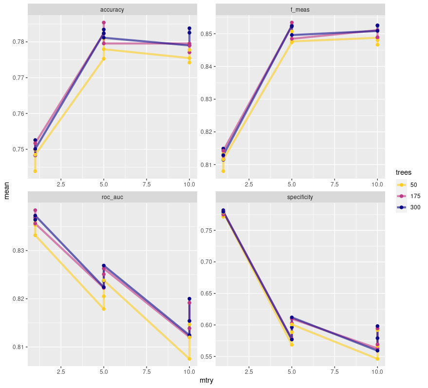
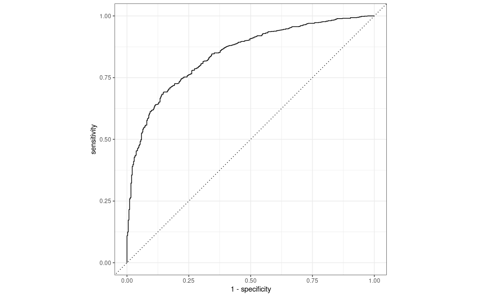

```{r setup, include=FALSE}
knitr::opts_chunk$set(echo = TRUE)

library(dplyr)      # For all general data work
library(tidymodels) # For everything models
library(yardstick)  # For model performance evaluation
library(rsample)    # For bootstrapping and sampling purposes
library(parsnip)    # For a standardized modeling interface
library(themis)     # To handle unbalanced data
library(ranger)     # for random forests
```

# Overview

This report covers my process developing a machine learning model to predict customer **churn**, otherwise known as customer service cancellation, within the provided [data set from Telco](https://www.kaggle.com/datasets/blastchar/telco-customer-churn). This data set contains a variety of information, such as various services the customer signed up for, alongside account and demographic data. My general process involved some light data exploration and analysis before learning the ins and outs of two different types of models. The task I was given was that of **classification**, predicting customers that do and do not churn. Therefore I picked two models commonly used for classification, **logistic regression** and **random forests**. 

# Data Exploration / Analysis

Before we get started it's important that we read in and understand the data set we are working with. `skimr::skim()` is a fantastic tool for the job, showing the vast majority of information one may be curious about. 

```{r}
telco_data <- 
    readr::read_csv("data/WA_Fn-UseC_-Telco-Customer-Churn.csv") %>%
    mutate(Churn = as.factor(Churn))

telco_data %>% skimr::skim()
```

The information we glean from this is vast. First off, what we see is a ton of character type variables. Only one of them has more than 4 unique values as well, that being the **customerID** column. This gives us a ton of factors to work with and will be something to consider. Alongside that are 4 numeric variables, though one is a bit different from the others. **SeniorCitizen** has only two possible values, 0 and 1. It's a boolean, so we'll be treating it like the other character variables later on. 

As for the other numeric variables, we can see that they vary greatly in scale and that none of them are close to a normal distribution. We'll be looking at that more closely momentarily with some larger plots, but we'll have to tackle those hurdles if we want anything resembling accurate predictions with logistic regression. 

We also don't have many missing values, but they are there. Thankfully they are limited to one column, **TotalCharges**. Missing values are primarily a challenge for random forests, so we'll need to find the right method to tackle that when we get there. 

The other thing we need to check is customer churn, how many of each are in the data set?

```{r}
telco_data %>%
    dplyr::group_by(Churn) %>%
    dplyr::summarise(
        count = n(),
        percent = n() / nrow(telco_data) * 100
    )
```

What we see here is a huge imbalance, a roughly 75/25 split for no/yes. Unbalanced data is an issue, it makes predictions harder to make and destroys the value of certain metrics. **Accuracy**, for instance, can be totally misleading as the 75 split can outweigh the smaller, and sometimes more valuable, split. Thankfully, unbalanced data can be remedied using a few methods. The first is **data stratification**, a technique that allows any smaller data sets we make to have the same statistical breakdown as the other. We can apply stratification to our churn column to ensure any samples we make roughly represent that distribution from the main data set. The other technique is **up-sampling**, done using the `themis` package. This technique samples until the two parts of the factor, yes and no in our case, are equal in frequency. I utilized both techniques in this project, and in retrospect I wonder if the two techniques are contradictory. Due to time constraints this potential flaw will not be explored, but the thought will be entertained with future reading. 

Next up is looking at our non-boolean numeric variables. Judging from `skimr::skim()` earlier we think the distribution is non-normal, but let's get a closer look.

```{r, out.width = "70%"}
telco_data %>%
    ggplot(aes(x = MonthlyCharges)) +
    geom_histogram(bins = 30, color = "white")

telco_data %>%
    ggplot(aes(x = TotalCharges)) +
    geom_histogram(bins = 30, color = "white")

telco_data %>%
    ggplot(aes(x = tenure)) +
    geom_histogram(bins = 30, color = "white")
```

From here we can certainly confirm our suspicions. Vastly different scales and nothing approaching normality. I'll be using two techniques to circumvent this issue, **log transformations** and **normalization**. This will make the data a lot friendlier to work with for our logistic regression model but will not be necessary for the random forest model. 

There's one other thing we can look at as well. What is the frequency of customers who churn based on the numeric variables? For instance, based on monthly charges is there a higher frequency of customer churn at a specific value? Let's find out. This is actually something I didn't look at until far later in the projects life. It simply did not occur to me to check when it seems so obvious in retrospect. It paints a very important picture.

```{r, out.width="70%"}
telco_data %>%
    filter(Churn == "Yes") %>%
    ggplot(aes(x = tenure)) +
    geom_histogram(bins = 20, color = "white")

telco_data %>%
    filter(Churn == "Yes") %>%
    ggplot(aes(x = MonthlyCharges)) +
    geom_histogram(bins = 20, color = "white")

telco_data %>%
    filter(Churn == "Yes") %>%
    ggplot(aes(x = TotalCharges)) +
    geom_histogram(bins = 20, color = "white")
```

There are some big conclusions we can draw from this. Customers with less tenure discontinue service at a higher frequency. This is unsurprising to me, people who have stuck around will continue to stick around. Seeing it reflected in the data to such a degree is very important though. We also see that customers who pay more per month tend to discontinue service at a higher frequency. It's possible there is some break point in monthly payments where customers are no longer willing to continue service. This is a possibility I was, unfortunately, unable to explore. Lastly, customers who have spent less total on telco's services are more likely to discontinue. This is similar to tenure. I would expect these three to be good predictors of churn as they seem intuitively useful. Catching this earlier in the projects life would have been invaluable.

Now that we've seen the basic overview of our data we can begin tackling our first model. Actually, not quite. It's easy to forget but making models is pointless without a reference point. We need a **null model**. 


# The Null Model 

Before we get started we need to split our data. For the sake of reproducibility I set an arbitrary seed beforehand.

```{r}
set.seed(500)

# Split data into training and testing data sets using an 80/20 split
telco_split <- telco_data %>%
    rsample::initial_split(prop = 0.8)

telco_train <- telco_split %>%
    rsample::training()

telco_test <- telco_split %>%
    rsample::testing()
```

Afterwards we create the null model. It's a very simple one. Essentially it will always assume the null hypotheses, that the customer will not churn. Based on the 75/25 split of the full data set we can assume this model will have an accuracy of approximately 75%. That's our base line. If our models can't beat that then we have a problem.

```{r}
# Create the null model
mod_null <- 
    logistic_reg(mode = "classification") %>%
    set_engine("glm") %>%
    fit(Churn ~ 1, data = telco_train)

# Compute accuracy of null model for future comparisons
pred <- telco_train %>%
    dplyr::bind_cols(
        predict(mod_null, new_data = telco_train, type = "class")
    ) %>% 
    dplyr::rename(Churn_null = .pred_class)

# Method 1 ----
yardstick::accuracy(data = pred, Churn, Churn_null)

# Method 2 ----
confusion_null <- pred %>%
    yardstick::conf_mat(truth = Churn, estimate = Churn_null)
confusion_null
```

# Logistic Regression Model


In my scripts I tested a few different versions of logistic modeling with some tweaks to the pre-processing. For the sake of brevity I will not be showing that here and will instead keep to the final version I utilized. 

Overall a lot of the work goes into the recipe when doing logistic regression. Pre-processing is very important so making sure your data and variables are prepped is essential. The below chunk looks like a lot but I can break it down.

- First we get a recipe which is our formula. We have Churn as the output, and the period specifies that we will be using all predictor variables to predict it. 

- Next we up-sample, setting a 1:1 ratio for yes/no in churn. We yet again consider if this even does anything due to stratification also being used.

- We turn **SeniorCitizen** into a factor. and remove all missing values from any columns.

- We log transform and normalize our numeric variables, we do this **after** the previous step to ensure **SeniorCitizen** isn't captured.

- We set all our nominal (categorical) variables to be dummy variables.

- We remove variables that are too highly correlated to each other and any variables that have zero variance.

```{r}
log_reg_recipe <- 
    recipe(Churn ~ ., data = telco_train) %>%
    step_upsample(Churn, over_ratio = 1) %>%                  # Set number of samples for 'yes' and 'no' equal
    update_role(customerID, new_role = "id") %>%
    step_mutate(SeniorCitizen = as.factor(SeniorCitizen)) %>%
    step_naomit(everything(), skip = TRUE) %>%
    step_log(tenure, MonthlyCharges, TotalCharges) %>%        # log transform non-normal numeric variables
    step_normalize(tenure, MonthlyCharges, TotalCharges) %>%  # z-standardize all numeric variables
    step_dummy(all_nominal_predictors()) %>%
    step_corr(all_numeric_predictors(), threshold = 0.7) %>%  # Remove highly correlated variables
    step_zv(all_numeric_predictors())                         # Remove numeric variables with zero variance
```

Next we set up our **workflow**, which includes a **model** and the **recipe** we just generated.

```{r}
# Set up model ----
log_reg_model <- 
    logistic_reg(mode = "classification") %>%
    set_engine("glm")

log_reg_workflow <-
    workflow() %>%
    add_model(log_reg_model) %>%
    add_recipe(log_reg_recipe)
```

After this comes re-sampling methods and getting metrics for our model! I use two re-sampling methods in this part of the project, **bootstrapping** and **10-fold cross validation**. I set a variety of metrics I'm interested in looking at as well. First, let us look at the bootstrapping method.

```{r}
# List off metrics I'm interested in capturing ----
my_metrics <- metric_set(accuracy, sensitivity, specificity, precision, recall, f_meas, roc_auc)

# Bootstrap the training data 5 times ----
telco_bstraps <-
    bootstraps(
        telco_train,
        times = 5,
        strata = Churn
    )

# Predictions on each of the 5 samples ----
log_reg_resamples <-
    log_reg_workflow %>%
    fit_resamples(
        resamples = telco_bstraps,
        metrics = my_metrics,
        # Save predictions for confusion matrix
        control = control_resamples(save_pred = TRUE)
    )

# Overall metrics for the samples ----
log_reg_resamples %>%
    collect_metrics()
```

We get a bunch of metrics here, each of them are important to understand. We also need to understand these with respect to the null hypotheses.

- **Null Hypotheses:** The customer does NOT churn. True positive is a correct guess that the customer does not churn. True negative is a correct guess that the customer does churn. It feels backwards, but this is important to realize when examining all of the given metrics.

- **Accuracy:** The most intuitive of the metrics, this shows how often our models predictions were correct. Our model had an accuracy of around **.75**, which is roughly the same as our null model. Essentially this means that when our model guesses 'yes' or 'no', 3 out of 4 times it gets the correct answer. It is important to consider any issues with data or methodological decisions that may make accuracy more or less important. In our case, any potential conflicts between stratification and up-sampling may make this metric less reliable. If the stratification over-rides the up-sampling for instance, the 'no' guesses outweigh the 'yes' guesses which can result in a high accuracy despite poor performance on 'yes' predictions.

- **Precision:** This show us the number of true positive predictions with relation to the number of false positive predictions the model made. Our model has quite a respectable value at around **.90**. This indicates that when the model predicted that a customer did **NOT** churn, 90% of those predictions were on the mark. 

- **Recall:** Also known as **sensitivity**, this is our true positive rate. A high sensitivity score indicates we had few false negatives and were able to capture almost all of the positive values in the set. In our case this would be our models ability to correctly capture as many of the customers who did not churn as possible. Our sensitivity score was around **.74** which indicates the model falsely classified around a quarter of all the **genuinely** positive values. Essentially our model took a quarter of the customers that did not churn and inaccurately predicted that they did.

- **F_meas or F1 Score:** This is the harmonic mean of precision and recall. Essentially it shows the balance between the two metrics in the model. This is important because these two metrics have a trade-off, attempting to maximize one will lower the other. Ours is around **.81** which indicates that, despite their values, the two scores are relatively balanced overall and we can observe from the value of precision and recall that this model is preferring **precision** in this specific trade-off.

- **Specificity:** This shows the true negative rate which indicates how well a model does at capturing all values that genuinely go against our null hypotheses, which in our case is customers that **DO** churn. So, using this metric we can see how well the model catches all the customers who discontinue service. We got around **.79** which is okay, we miss around a fifth of the customers who churn which could use some improvement. 

- **roc_auc:** This the area under the given models roc curve. This curve has the true positive rate (**recall**) on the y-axis and the false positive rate (**1 - specificity**) on the x-axis. The closer to 1 the area under this curve is the better, and our model scores around a **.84** here which is respectable. 

```{r}
# Confusion matrix for re-samples ----
log_reg_resamples %>%
    conf_mat_resampled()
```

From the **confusion matrix** we can the inaccuracy of our model clearly. This model handles the 'no' prediction fine, but is basically a coin flip when it comes to the 'yes' prediction. Getting that resolved would go a long way to improving the models performance overall. 

Let us re-run these computations using 10-fold cross validation instead! We see pretty similar numbers to the bootstrapping method we utilized. 

```{r}
telco_folds <- vfold_cv(telco_train, v = 10)
keep_pred <- control_resamples(save_pred = TRUE, save_workflow = TRUE)
cv_log_reg_res <- 
    log_reg_workflow %>%
    fit_resamples(
        resamples = telco_folds, 
        control = keep_pred,
        metrics = my_metrics
    )

cv_log_reg_res %>%
    collect_metrics()

cv_log_reg_res %>%
    conf_mat_resampled()
```

From here I got a bit lost on where to go. It took me far longer than I would care to admit to learn that there isn't much to tune with logistic models. I read and re-read chapters and was left scratching my head. I got frustrated and never ended up using this model on the test set. I decided instead of spinning my wheels I should try a model that could help me learn tuning, which is when I dove right into **random forests**.

# Random Forests using Ranger


For this we will set a new seed. Again, for the sake of brevity, I will spare showing the initial model. It ran into many of the same problems as the previous logistic model. I want to use this section to showcase model tuning, grid search, roc curves and variable importance plots. 

A big difference between our initial setup for this model as opposed to the logistic regression model is that of pre-processing. Random forests require very little. The one thing to keep in mind is missing values. There are a few strategies to handle those, such as outright removal or statistical imputation. I chose the latter for this. The missing values were from one column, **TotalCharges**, and I opted to input the mean of that column for any of the missing values I encountered as that is apparently a common strategy for handling those when training a model. It is possible there are superior or more ethically sound ways of handling those values, but, in this case, I made this decision after some very light reading on the topic. This is the perfect project to make mistakes like this I feel! 


Anyway, we set up a recipe, model and workflow just like the previous model.
```{r, eval=FALSE, echo=TRUE}
set.seed(501)

rf_recipe <-
    recipe(Churn ~ ., data = telco_train) %>%
    update_role(customerID, new_role = "id") %>%
    themis::step_upsample(Churn, over_ratio = 1) %>%          # Set number of samples for 'yes' and 'no' equal
    step_impute_mean(TotalCharges)                            # Use statistical imputation to handle missing values
    
tune_spec <-
    rand_forest(
        mtry = tune(),
        trees = tune(),
        min_n = tune()
    ) %>%
    # Set importance to permutation for variable importance plots later
    set_engine("ranger", importance = "permutation") %>%
    set_mode("classification")

# set up a grid for re sampling
tree_grid <- 
    grid_regular(
        mtry() %>% range_set(c(1,10)),
        trees() %>% range_set(c(50,300)),
        min_n() %>% range_set(c(2,10)),
        levels = 3
    )

tuned_wf <-
    workflow() %>%
    add_model(tune_spec) %>%
    add_recipe(rf_recipe)
```

There's a lot happening in the above code chunk. in `tune_spec` we set up a random forest with three parameters, all set to `tune()`. This value is a placeholder that we tackle further down in `tree_grid`. Essentially, what we're doing there is providing a range of values which `grid_regular` selects from. The number of values it chooses is specified by `levels` and allows us to easily test a variety of potential values for the hyper-parameters for our chosen type of model. 

In the example provided, mtry gets the values 1, 5 and 10. It generated 3 values because we specified `levels = 3`. When we later pass this into a 10-fold cross validation, models are fit using each of those values and we can pick out the best model from the batch. That is done using each of those range of parameters, so care needs to be taken to ensure computation time doesn't get out of hand for smaller personal assignments! Using some simple combinatorics, the grid we have generates $3^3 = 27$ rows, increasing levels to just 5 makes that go up to $5^3 = 125$ rows. That will end up being 4 times the computation time when we get to the cross validation. Always be aware of the scale of computations that you're asking the computer to do. I did exactly the opposite at first, and it took me longer than I care to admit to realize just how big of a computation request I had made. 

```{r, eval=FALSE, echo=TRUE}
tree_results <-
    tuned_wf %>%
    tune_grid(
        resamples = telco_folds,
        grid = tree_grid,
        metrics = metric_set(f_meas, roc_auc, accuracy, specificity),
        control = control_resamples(save_pred = TRUE)
    )
```

Now that we have our results ran through cross validation, let's compare metrics. We need to select out the best model, so let's look at performance based on the value of `mtry` for the different chosen values of `trees`.

```{r, eval=FALSE, echo=TRUE}
tree_results %>% 
    collect_metrics() %>%
    mutate(trees = as.factor(trees)) %>%
    ggplot(aes(mtry, mean, color = trees)) +
    geom_line(size = 1.5, alpha = 0.6) +
    geom_point(size = 2) +
    facet_wrap(~ .metric, nrow = 2) +
    scale_color_viridis_d(option = "plasma", begin = .9, end = 0)
```



This plot shows us quite the interesting story. It seems that an `mtry` of 5 is ideal for balancing out all the different metrics here. It's important to note the free scale here. `roc_auc` appears to be tanking, but barely budges more than .01 in value. `specificity` meanwhile genuinely tanks the more `mtry` increases. With an `mtry` of 5 we maximize our F1 score and accuracy while scoring a nice middle ground for `roc_auc`. The only way to maximize `specificity` is to set `mtry` to 1, which feels like a terrible idea. `mtry` dictates the number of predictor columns that are sampled, and with a data set that has 19 predictors, sampling only 1 feels like I'm asking for misleading information. It is also of note that the different tree values vary little in their metrics with 50 being solidly the worst of the three. 175 seems to be a solid choice. 

Regardless, we need not select from the plot. I can select out the best model based on whatever metric I want to maximize. I'll choose F1 score because that one seems to meet the criteria I'm interested in, and is a genuinely solid metric for gauging a models performance. 

```{r, eval=FALSE}
best_tree <- tree_results %>%
    select_best("f_meas")

# Now we finalize, or update, the workflow 
final_wf <-
    tuned_wf %>%
    finalize_workflow(best_tree)
```

Before we move on, let's look at the metrics we have for the best tree. This will be useful when comparing to its performance on the test set so we can see if we over or under fit the data.

```{r, eval=FALSE}
tree_results %>%
    collect_metrics() %>%
    filter(mtry == 5, trees == 175, min_n == 6)
```

```{r, eval=FALSE}
# A tibble: 4 × 9
#    mtry trees min_n .metric     .estimator  mean     n std_err .config              
#   <int> <int> <int> <chr>       <chr>      <dbl> <int>   <dbl> <chr>                
# 1     5   175     6 accuracy    binary     0.785    10 0.00565 Preprocessor1_Model14
# 2     5   175     6 f_meas      binary     0.853    10 0.00426 Preprocessor1_Model14
# 3     5   175     6 roc_auc     binary     0.825    10 0.00458 Preprocessor1_Model14
# 4     5   175     6 specificity binary     0.603    10 0.0121  Preprocessor1_Model14
```

Now we reach the final step, testing our model on that testing set we created so long ago. Funnily enough, that exact object will remain unused! `last_fit()` uses the original split object, fits the model to the training side and automatically evaluates it on the testing split. It's very convenient and we can do all the final steps we need using the results. First we collect 2 basic metrics.

```{r, eval=FALSE, echo=TRUE}
# This fits the model to the full training set and evaluates the 
# finalized model on the testing data
final_fit <-
    final_wf %>%
    last_fit(telco_split)

# Show collected metrics for the final fit
final_fit %>%
    collect_metrics()
```

```{r, eval=FALSE}
#   .metric  .estimator .estimate .config             
#   <chr>    <chr>          <dbl> <chr>               
# 1 accuracy binary         0.793 Preprocessor1_Model1
# 2 roc_auc  binary         0.846 Preprocessor1_Model1
```

From here we can see two metrics, `accuracy` and `roc_auc`, both boasting respectable values. I would like to get more metrics from this, but in all honesty how to do this within these final steps escapes me. Had I spent less time using poor values for grid searching maybe I would have been able to wrestle with this more but alas it was not meant to be. We can still draw conclusions though. Looking at the metrics of our best tree we see almost identical metrics for `accuracy` and `roc_auc`. This is great, it shows that our model appears to be a good fit for the data! If we saw large differences it may be a sign of our model over or under fitting the training set. Again, this isn't perfect. I'd like to compare far more metrics to see if there are any drastic differences I'm missing, but that just isn't possible with current time constraints. That will be my top priority when I revisit this. With the limited metrics that we have access too, our model seems to be a good fit. 

There are two other things we can examine as well, a plot of our ROC curve and our variable importance plot.

```{r, eval=FALSE}
# Create an ROC curve for our final fit
final_fit %>%
    collect_predictions() %>%
    roc_curve(Churn, .pred_No) %>%
    autoplot()
```



This curve simply shows us the sensitivity and specificity over different thresholds. In general, if your curve is hovering close to the diagonal line or jumping all over the place, your predictions may be more random than you would like. The ideal ROC curve hangs as close to the top left as possible. Our curve is relatively close to the top left and away from the diagonal line, which indicates our models predictions aren't based entirely on random chance. It's also a relatively smooth line, which is good to see. Ideally, you would want two of these curves. One from the training set and one from the testing set. Comparing `roc_auc` is good, but those values can be similar while having vastly different curves, so being able to compare those differences is useful. That's something I'd like to revisit and add in the future.

```{r, eval=FALSE}

# Variable Importance Plots
final_fit %>%
    extract_workflow() %>%
    extract_fit_parsnip() %>%
    vip::vip()
```


What we can see from this is that, at least according to how we set up our model, **tenure**, **TotalCharges** and **MonthlyCharges** are the biggest predictors of customer churn. We saw these in our plots earlier on in the report so it is unsurprising to see these as good predictors. I have to wonder if there is more I could potentially do with these predictors to improve the performance of the model.

# Conclusion

This was an incredibly informative assignment to work on. I went into this knowing next to nothing about anything related to machine learning and was able to get exposure to a wide variety of models and techniques. The majority of my time with this was simply spent reading as much as I could. For every few hours of reading I became confident to add a few lines of code. The number of ways you can approach these problems and tinker with them is so countless to be daunting, but I think what I learned is that this is a problem best solved with iteration. An initial model that is awful is still useful, you can continue to learn from it and improve upon what you learned there. By generating tons of models you can slowly narrow down to what you need. That is a process that requires experimentation, which is something I need to become more comfortable with. 

In retrospect I wish I had spent more time with data analysis. I really wanted to get into the machine learning part of the project quickly and that likely resulted in me missing out on a ton of insight into the data. Especially with a data set hosting 19 predictors, anything you can do to extract useful info not only makes the model better, it can also save computation time when you know what predictors to focus your energy on. That's a skill I will need to develop. How can I determine early on which predictors are likely to be useful? How can I determine the opposite? Is that something I should leave to the automatic pre-processing in the recipe or should I make it more of a priority? 

I also wonder if I picked the appropriate metric to maximize. My gut tells me that specificity, the true negative rate, is the useful metric here. Which customers churn is the valuable information, and that's what this measures here. I could never quite get past the models aggressive 'yes' guessing though when I worked on the logistic model. I have to wonder what I could have done differently to make it just a little bit pickier. 

Overall though I feel satisfied and proud of what I was able to accomplish in the short time span of one week. This has demystified the concept of machine learning to me and I'm excited to learn more. Apparently neural networks could be a possible solution to a problem such as this and I would be excited to give that a go someday. I also still need to explore DALEX and DALEXtra, I simply had to cut that due to time constraints. There is still so much more for me to explore and I'm looking forward to it. 

# Resources Used

[Tidy Modeling with R](https://www.tmwr.org/)

[Modern Data Science with R](https://mdsr-book.github.io/mdsr2e/ch-modeling.html)

[Precision vs. Recall](https://www.analyticsvidhya.com/blog/2020/09/precision-recall-machine-learning/)

[Bias and Variance](https://www.analyticsvidhya.com/blog/2020/08/bias-and-variance-tradeoff-machine-learning/?utm_source=blog&utm_medium=precision_and_recall)

[Metrics of Classification Models](https://medium.com/analytics-vidhya/how-to-select-performance-metrics-for-classification-models-c847fe6b1ea3)

[Classification model guide](https://www.kirenz.com/post/2021-02-17-r-classification-tidymodels/)

[Themis package for unbalanced data](https://themis.tidymodels.org/index.html)

[Tidymodels Tuning Chapter](https://www.tidymodels.org/start/tuning/)