# Overview and Motivation

Here I'll be showing a standard workflow for fine tuning a large language model using the `transformers` library in Python. I'll be fine tuning for the specific downstream task of **named entity recognition**, though many things in this setup will work for other tasks as well. 

There are many sources online for this topic, but I found myself extremely overwhelmed by all of the information when first learning how to do this. My goal here is to consolidate all of that information and add in a lot of my own thoughts along the way to hopefully help make this area less overwhelming. 

In terms of knowledge coming in, this page is intended for a data scientist who is comfortable reading code and technical documentation. A basic understanding of machine learning and natural language processing is expected. I will be explaining much of the jargon, but not all of it. 

For a repository to follow along with, I have a notebook that will be showing my process from start to finish. [\<Here is a link to that notebook\>](https://github.com/blamson/transformers_tutorial/blob/main/notebooks/transformers_tutorial.ipynb).

Our goal here is to take a pretrained large language model and have it extract specific "entities" from a given text. To do that, we need to fine tune it for our specific needs. First off, what are these entities and what is named entity recognition?

## Named Entity Recognition

Without going into too much detail, named entity recognition, or NER for short, is a type of token classification that allows for us to identify key parts of text. As an example, a model can predict which words in a sentence represent people, places, organizations, etc. The best way to explain NER is with a visual.

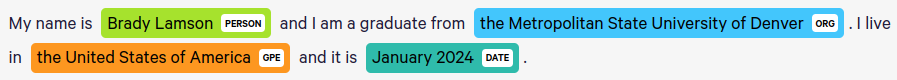

This is an extremely useful task, as being able to identify key parts of bulk text has a ton of applications. You can even choose what entities you want to identify so there's a ton of creative freedom here. You could web scrape a site and easily extract the big names on its pages. From a tech tutorial example, you could use NER on a ton of writeups like these to see which packages and tools come up the most! 

In particular this has a lot of applications in bulk messy text that you want classified. Being able to identify the date or company name of a giant text blob could be extremely useful for expediting some data processing. It's never going to be perfect, but it can be extremely powerful.

## Fine Tuning

**Fine tuning** is simply a type of training you do to models that already exist. We don’t want to make a model from scratch, but most models by default aren’t capable of what we’re trying to do and aren’t going to be familiar with the type of data we’re using. Thus, we need to modify them a bit.

As an example, for this project we'll be using the distilibert-base-uncased model. To put it simply, it's a smaller version of BERT that ignores capitalization. From the [\<model docs\>](https://huggingface.co/distilbert-base-uncased) specifically:

> **Intended uses & limitations**
>
> You can use the raw model for either masked language modeling or next sentence prediction, but it's mostly intended to be fine-tuned on a downstream task. See the [\<model hub\>](https://huggingface.co/models?other=distilbert) to look for fine-tuned versions on a task that interests you.
>
> Note that this model is primarily aimed at being fine-tuned on tasks that use the whole sentence (potentially masked) to make decisions, such as sequence classification, token classification or question answering. For tasks such as text generation you should look at model like GPT2.

## Downstream Tasks

**Downstream Tasks** are tasks like “named entity recognition”, “text classification” and other more niche language tasks. A better explanation is provided by [\<Baeldung here in their overview on downstream tasks\>](https://www.baeldung.com/cs/downstream-tasks). Here’s a relevant excerpt.

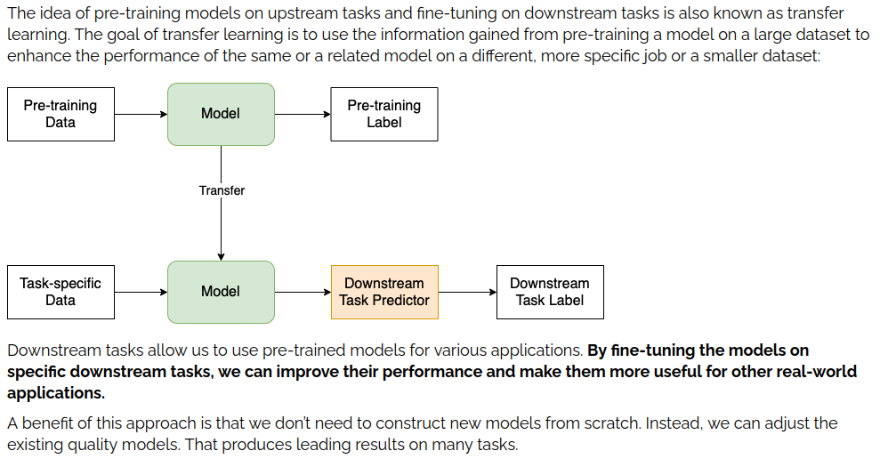

So, our goal is to take our model of choice and get it used to our data and entities. To do that, we fine-tune the model! That's the plan.

# Overall Structure

To execute on the plan we need to get the general gist of how to accomplish it. To do this I created a diagram that shows how all of the pieces fit together. 

It may be a bit overwhelming at first but it proved to be an invaluable resource for me while learning. I recommend referring back to this as we progress.

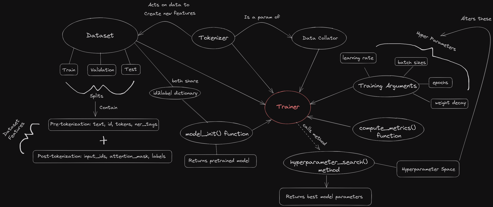

You may notice how the `trainer` is at the center of everything. Basically, the primary goal of using the standard transformers library is that everything plugs into the trainer object at the end. The bulk of the workflow is building and modifying all of the component pieces of the trainer. Once that’s done, doing any modifications is a cinch. So, we want to look at the trainer's requirements and expectations so we can build our pieces around that. But what is the trainer?

## The Trainer

[\<Documentation Link\>](https://huggingface.co/docs/transformers/main_classes/trainer)

To put it simply the Trainer is how we train our model. Wow. Helpful. To be more specific, the Trainer abstracts out the fine tuning process for us which saves us on a lot of work. It supports standard training, early stopping, grid search, specifying different optimization metrics and way more. So it strikes a good balance of abstraction while still giving you a lot of control over how it works. It is not required at all, but for a setup that uses it you’ll want to revolve your designs around what it wants.

Referring back to the diagram, the trainer requires the following pieces:

* A dataset
* A tokenizer
* A data collator
* A model initialization function
* A hyperparameter space
* Training arguments
* A function for computing metrics
* id2label dictionary

Not all of these will be required for every project, but they are for my write up. As an example, a hyperparamter space is only required if you want to use the trainers hyperparameter search method.

# The Dataset

While the Trainer may be at the center, the data is the most important part of this process. Setting this up properly will be the difference between a model that performs excellently and one that is actually worse than the original one. As the mantra goes, garbage in garbage out. This section is more concerned with the structure of the dataset object specifically, setting up training data for NER is an enormous project on its own and is outside the scope of this page. 

For this demonstration I'll be using the [\<CoNLL2003 Dataset\>](https://huggingface.co/datasets/conll2003)

> The shared task of CoNLL-2003 concerns language-independent named entity recognition. We will concentrate on four types of named entities: persons, locations, organizations and names of miscellaneous entities that do not belong to the previous three groups. The CoNLL-2003 shared task data files contain four columns separated by a single space. Each word has been put on a separate line and there is an empty line after each sentence. The first item on each line is a word, the second a part-of-speech (POS) tag, the third a syntactic chunk tag and the fourth the named entity tag. The chunk tags and the named entity tags have the format I-TYPE which means that the word is inside a phrase of type TYPE. Only if two phrases of the same type immediately follow each other, the first word of the second phrase will have tag B-TYPE to show that it starts a new phrase. A word with tag O is not part of a phrase. Note the dataset uses IOB2 tagging scheme, whereas the original dataset uses IOB1.

This dataset conveniently contains all of the features I need for this tutorial. Obviously in the real world you'll need to put in a sizable amount of effort to getting labeled data and putting it into this format, but that's outside the scope of this tutorial. I at least hope that showing what I'm working with and explaining what all the various features represent will help you understand what you're aiming for and why.

## Loading the Data

```
In: 

from datasets import load_dataset

dataset = load_dataset("conll2003")
# Cut the training split in half for demonstration purposes. I AINT GOT ALL DAY
dataset["train"] = dataset["train"].train_test_split(test_size=0.5)["train"]
dataset
```

```
Out:  

DatasetDict({
    train: Dataset({
        features: ['id', 'tokens', 'pos_tags', 'chunk_tags', 'ner_tags'],
        num_rows: 7020
    })
    validation: Dataset({
        features: ['id', 'tokens', 'pos_tags', 'chunk_tags', 'ner_tags'],
        num_rows: 3250
    })
    test: Dataset({
        features: ['id', 'tokens', 'pos_tags', 'chunk_tags', 'ner_tags'],
        num_rows: 3453
    })
})
```

### What is this thing?

So this is a `DatasetDict` that contains all of our splits as individual `Dataset` objects. This setup is designed to work very well with huggingface transformers and is what I'll be using for this demonstration. As for all the features, I'll explain those in a moment. If you need help figuring out how to use these objects. I'd check out [\<the docs that can be found here\>](https://huggingface.co/docs/datasets/index). 

## Example Row Format

Many of these strings are quite long and result in messy output so I'll just show you a skeleton of what they look like individually.

```
{
  'id': int,
  'tokens': ['foo', 'bar', 'foobar'],
  'pos_tags': [int, int, int],
  'chunk_tags': [int, int, int],
  'ner_tags': [int, int, int]
}
```

Okay, so what is this? Let's demystify the features a bit.

* id: It's just the id. That's it. An integer
* tokens: A string broken up into its component parts. A list of strings.
* pos_tags: Not sure and not relevant to this demonstration. We'll be dropping this.
* chunk_tags: Not sure and not relevant to this demonstration. We'll be dropping this as well.
* ner_tags: These integers represent the label assigned to each token. We can translate these numbers and get their labels.

Let's take a closer look at the `ner_tags`.

```
In: dataset["train"].features["ner_tags"]
Out: Sequence(feature=ClassLabel(names=['O', 'B-PER', 'I-PER', 'B-ORG', 'I-ORG', 'B-LOC', 'I-LOC', 'B-MISC', 'I-MISC'], id=None), length=-1, id=None)
```

Yet again we have more custom classes straight from the `datasets` library. These will be useful if you're converting over to this format manually. So, we have a `Sequence` of `ClassLabels`. For our purposes this is largely what it says on the tin. Each of the integer values in the `ner_tags` feature corresponds to these labels. 

As for the labels themselves, what do they mean? What are the prefixes?

## NER Label Formats

**IOB**

There are many ways to format a dataset for NER, and, recall from the docs that our "dataset uses IOB2 tagging scheme". IOB stands for "inside, outside, beginning" and refers to the prefixes in those labels. Quoting the [\<huggingface token classification tutorial\>](https://huggingface.co/docs/transformers/tasks/token_classification): 

>     B - indicates the *beginning* of an entity.
>     I - indicates a token is contained *inside* the same entity.
>     0 - indicates the token doesn’t correspond to any entity. It is *outside* our entity list.

To elaborate further let's use an example. 

```
string: "Jane Doe went to Sega headquarters"
tokens: ["Jane", "Doe", "went" "to", "Sega", "headquarters"]
translated ner_tags: ["B-PER", "I-PER", "O", "O", "B-ORG", "O"]
```

Jane Doe is a persons name that is split into two tokens. So each token is represented with their own label. Note that if Jane had 5 names instead of just a last name, each of those names would also have the "I-PER" label. The next two words are labeled "O" as they're just words, not entities. Then "Sega" is given a "B-ORG" label as its an organization and "B-" is also used for single word entities. 

### Quick glimpse at other common formats:

**BILUO**

This one stands for "beginning, inside, last, unit, outside" which is very similar to iob but with two new labels. "L-" is for the end of an entity. So "Doe" in our example would be "L-PER". "U-" is for single token entities. So "Sega" would be "U-ORG" in our example. 

**Offsets**

This one is quite different and uses index spans to specify entity locations. We don't use tokens here as we use string indices so we use the full string. The format is `[(start_index, end_index, entity_name), (start_index, end_index, entity_name), ...]`

```
string: "Jane Doe went to Sega headquarters"
offsets labels: [(0, 8, "PER"), (17, 21, "ORG")]
```

There are others, but these are what I have exposure to. None are strictly better than the other and different frameworks or models will expect different formats. So be prepared for that. Anyway, moving on.

## Wait, my data doesn't look like yours!

That's expected. I'm working with a demo dataset after all. If you need to convert over to the `datasets` format there is yet another place hidden in the docs that serves as a good guide. The [\<docs for the model evaluator\>](https://huggingface.co/docs/evaluate/v0.4.0/en/package_reference/evaluator_classes#evaluate.TokenClassificationEvaluator) feature a fantastic template for converting over. There are multiple functions to convert from various formats while making use of the classes I mentioned above.

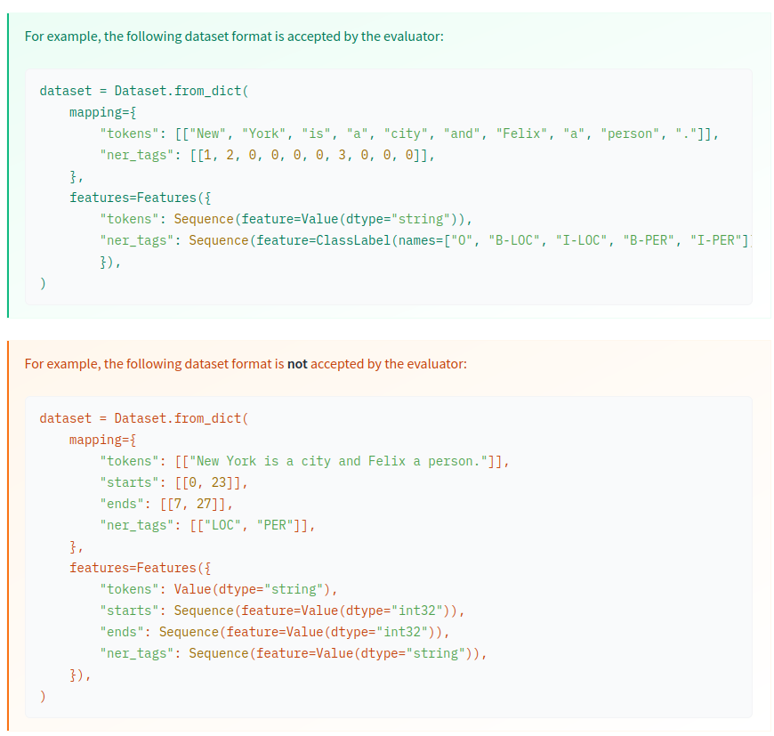

While this image is for stuff the evaluator is okay with, it's actually a great demo of converting and is what I used when I first learned how!

Depending on how your data was labeled, you may need to convert between formats beforehand. If you're using a pandas dataframe there are also functions to go from that to a dataset as well. That's a little outside the scope of this write up unfortunately but I wanted to give you a jumping off point at least.

Now, actually moving on, we're going to remove the features we don't care about and extract out the names of our labels. We'll need them later.

```
label_list = dataset["train"].features["ner_tags"].feature.names
dataset = dataset.remove_columns(['pos_tags', 'chunk_tags'])
```

## Tokenizing the Data

The data seems to already be tokenized but it isn't completely. It's been split up, yes, but different models require subtly different formats for their tokenized data. So we'll be throwing our data through the pretrained tokenizer that is built for the model we'll be using, `distilbert-base-uncased`.

```
from transformers import AutoTokenizer

model_name = "distilbert-base-uncased"
tokenizer = AutoTokenizer.from_pretrained(model_name)
```

### Example Tokenization

```
In:

example_row = dataset["train"][0]
tokenized_input = tokenizer(example_row["tokens"], is_split_into_words=True)
tokens = tokenizer.convert_ids_to_tokens(tokenized_input["input_ids"])
print(f"Original Tokens: {example_row['tokens']}")
print(f"Updated Tokens: {tokens}")
```

```
Out:

Original Tokens: [
  'The', 'Bradys', 'walked', 'on', 'to', 'the', 'stage', ',', 'he', 'on', 'her', 'arm', 'and', 'with', 'the',
  'aid', 'of', 'a', 'cane', ',', 'to', 'a', 'rousing', 'reception', 'from', 'the', 'convention', '.'
]
Updated Tokens: [
  '[CLS]', 'the', 'brady', '##s', 'walked', 'on', 'to', 'the', 'stage', ',', 'he', 'on', 'her', 'arm', 'and', 'with', 
  'the', 'aid', 'of', 'a', 'cane', ',', 'to', 'a', 'ro', '##using', 'reception', 'from', 'the', 'convention', '.', '[SEP]'
]
```

Some notes: First, notice the new tokens. `[CLS]` and `[SEP]`. These are special tokens that indicate the start and end of a string. Secondly, you may notice all of our text is now lowercase aside from the special tokens. That's due to our model being an "uncased" variant. This helps with the models size as it has to work with less overall characters. Lastly, we have way more tokens now. "rousing" for instance has been broken up into two tokens. This is due to berts "subword tokenization" which breaks up words into more manageable "subwords". Again, this is for space and efficiency. 

Of note here is that we don't have more ner tags to compensate for the new tokens. If we tried to use those tags they'd be misaligned and incorrect. Thankfully the folks over at huggingface provide us with a function to help realign our labels. 

### Applying Tokenizer and Realigning Labels
This function can be found in its original form [\<in the token classification tutorial\>](https://huggingface.co/docs/transformers/tasks/token_classification).

```
from transformers import PreTrainedTokenizer

def tokenize_and_align_labels(examples, tokenizer: PreTrainedTokenizer, label_all_word_parts: bool=False):
    
    tokenized_inputs = tokenizer(examples["tokens"], truncation=True, is_split_into_words=True)

    labels = []
    for i, label in enumerate(examples[f"ner_tags"]):
        word_ids = tokenized_inputs.word_ids(batch_index=i)  # Map tokens to their respective word.
        previous_word_idx = None
        label_ids = []
        for word_idx in word_ids:  # Set the special tokens to -100.
            if word_idx is None:
                label_ids.append(-100)
            # Default behavior only labels the first token of a given word
            # But sometimes you may want to label all the word parts for very specific use cases.
            elif label_all_word_parts or (word_idx != previous_word_idx):
                label_ids.append(label[word_idx])
            else:
                label_ids.append(-100)
            previous_word_idx = word_idx
        labels.append(label_ids)

    tokenized_inputs["labels"] = labels
    return tokenized_inputs
```

This function makes a few specific calls that I think are worth pointing out. Let's look at the link I provided.

>   1. Mapping all tokens to their corresponding word with the word_ids method.
>   2. Assigning the label -100 to the special tokens [CLS] and [SEP] so they’re ignored by the PyTorch loss function (see CrossEntropyLoss).
>   3. Only labeling the first token of a given word. Assign -100 to other subtokens from the same word.

Number 3 is worth calling out here. This functionality is something you may not want if you're working with weird non-traditional data. Say, like transaction strings that can be really messy and non-grammatical. In some niche cases labeling all the word parts can be advantageous so I add in an option for that here. 


So, now we apply this function to our dataset.

```
In: 
tokenized_ds = dataset.map(
    lambda examples: tokenize_and_align_labels(examples, tokenizer=tokenizer),
    batched=True
)

tokenized_ds
```

```
Out:
DatasetDict({
    train: Dataset({
        features: ['id', 'tokens', 'ner_tags', 'input_ids', 'attention_mask', 'labels'],
        num_rows: 7020
    })
    validation: Dataset({
        features: ['id', 'tokens', 'ner_tags', 'input_ids', 'attention_mask', 'labels'],
        num_rows: 3250
    })
    test: Dataset({
        features: ['id', 'tokens', 'ner_tags', 'input_ids', 'attention_mask', 'labels'],
        num_rows: 3453
    })
})
```

Wow, that's a lot of new features. Let's check out an example row. It's gonna be a messy one, bear with me.

```
In:
import numpy as np
example = tokenized_ds['train'][0]

print(example.keys())
print(f"input_ids: {example['input_ids']}")
print(f"labels: {example['labels']}")
print(f"attention: {example['attention_mask']}")
decoded_ids = [tokenizer.decode(id) for id in example["input_ids"]]
translated_labels = [label_list[label] if label != -100 else label for label in example['labels']]
print("\ntranslated ids and labels:")
for i in np.arange(len(example['input_ids'])):
    print(decoded_ids[i], translated_labels[i])
```

```
Out:
dict_keys(['id', 'tokens', 'ner_tags', 'input_ids', 'attention_mask', 'labels'])
input_ids: [101, 1996, 10184, 2015, 2939, 2006, 2000, 1996, 2754, 1010, 2002, 2006, 2014, 2849, 1998, 2007, 1996, 4681, 1997, 1037, 11942, 1010, 2000, 1037, 20996, 18161, 7684, 2013, 1996, 4680, 1012, 102]
labels: [-100, 0, 1, -100, 0, 0, 0, 0, 0, 0, 0, 0, 0, 0, 0, 0, 0, 0, 0, 0, 0, 0, 0, 0, 0, -100, 0, 0, 0, 0, 0, -100]
attention: [1, 1, 1, 1, 1, 1, 1, 1, 1, 1, 1, 1, 1, 1, 1, 1, 1, 1, 1, 1, 1, 1, 1, 1, 1, 1, 1, 1, 1, 1, 1, 1]

translated ids and labels:
[CLS] -100
the O
brady B-PER
##s -100
walked O
on O
to O
the O
stage O
, O
he O
on O
her O
arm O
and O
with O
the O
aid O
of O
a O
cane O
, O
to O
a O
ro O
##using -100
reception O
from O
the O
convention O
. O
[SEP] -100
```

Let's demystify the new stuff. 

- input_ids: Tokens translated to numbers by the tokenizer.
- attention mask: Does the model pay attention to this token or not? You get 0s here when you start adding padding. A 0 simply means that token will be ignored during training. We haven't used padding so there aren't any 0s here.
- labels: updated ner_tags to accommodate special tokens

It's important to translate these numbers back to words so we can verify stuff is working as anticipated. Whenever stuff is changed you need to be confident it was changed correctly. 

### Sanity Checks

What would be bad are inequalities in length for features here. For example, if input_ids has a different length than labels this would break the training process and potentially indicate some deeper issues. Quick note

* tokens and ner_tags should be of equal length
* All the new features should be of equal length

Let's look at a few rows and see if this seems to check out. I'll spare you the input here.

```
Out:

Tokens Length: 28
NER Tags Length: 28
Input IDs Length: 32
Attention Mask Length: 32
Labels Length: 32

Tokens Length: 21
NER Tags Length: 21
Input IDs Length: 28
Attention Mask Length: 28
Labels Length: 28

Tokens Length: 8
NER Tags Length: 8
Input IDs Length: 12
Attention Mask Length: 12
Labels Length: 12

Tokens Length: 9
NER Tags Length: 9
Input IDs Length: 11
Attention Mask Length: 11
Labels Length: 11

Tokens Length: 20
NER Tags Length: 20
Input IDs Length: 24
Attention Mask Length: 24
Labels Length: 24
```

Quick check seems fine. The old features are the same length and the new features all match as well. I'd recommend a more thorough check but this is just for the sake of demonstration so I'm allowed to be lazy. 🤷

Now it's time to get into the meat of this operation! 

# Building the Trainer

So, we have the following left to setup for the trainer.

* A data collator
* A model initialization function
* A hyperparameter space
* Training arguments
* A function for computing metrics
* id2label dictionary

This will go a lot quicker.

## Imports

```
from transformers import (
    DataCollatorForTokenClassification, 
    AutoModelForTokenClassification, 
    TrainingArguments, 
    Trainer, 
    EarlyStoppingCallback
)
import evaluate
import numpy as np
```

## Data Collator

[\<Documentation\>](https://huggingface.co/docs/transformers/main_classes/data_collator)

This lad is in charge of all things batches. They're also capable of doing batch padding as well, and that will be necessary here.

```
data_collator = DataCollatorForTokenClassification(tokenizer=tokenizer)
```

## Evaluator: compute_metrics function

This object handles how model performance is calculated during training. You can manually create whatever metrics you like and use those to optimize the model. I'll yet again be deferring to the tutorial and using their function. Note that as your problem gets more and more niche that you'll want to consider writing this one yourself. These basic metrics or how they're computed may not fit your needs.

Note that this function utilizes `seqeval` and I recommend reading up on how it classifies true/false predictions so you can properly interpret results.

[\<Seqeval Docs\>](https://huggingface.co/spaces/evaluate-metric/seqeval)

```
import evaluate
seqeval = evaluate.load("seqeval")

# Note: Uses the label_list we created earlier
def compute_metrics(p):
    predictions, labels = p
    predictions = np.argmax(predictions, axis=2)

    true_predictions = [
        [label_list[p] for (p, l) in zip(prediction, label) if l != -100]
        for prediction, label in zip(predictions, labels)
    ]
    true_labels = [
        [label_list[l] for (p, l) in zip(prediction, label) if l != -100]
        for prediction, label in zip(predictions, labels)
    ]

    results = seqeval.compute(predictions=true_predictions, references=true_labels)
    return {
        "precision": results["overall_precision"],
        "recall": results["overall_recall"],
        "f1": results["overall_f1"],
        "accuracy": results["overall_accuracy"],
    }
```

## Id and Label Maps

We need both directions of this map for our trainer. Nothing complex here, just a number -> label dictionary.

```
In:
label2id = {label: index for index, label in enumerate(label_list)}
id2label = {value: key for key, value in label2id.items()}

print(f"label2id: {label2id}")
print(f"id2label: {id2label}")
```

```
Out: 
label2id: {'O': 0, 'B-PER': 1, 'I-PER': 2, 'B-ORG': 3, 'I-ORG': 4, 'B-LOC': 5, 'I-LOC': 6, 'B-MISC': 7, 'I-MISC': 8}
id2label: {0: 'O', 1: 'B-PER', 2: 'I-PER', 3: 'B-ORG', 4: 'I-ORG', 5: 'B-LOC', 6: 'I-LOC', 7: 'B-MISC', 8: 'I-MISC'}
```

## Model Initializer

This step is only necessary if you're using hyperparameter search using the built in trainer method. This allows us to initialize a new model between grid searches.

```
def model_init():
    return AutoModelForTokenClassification.from_pretrained(
        model_name, 
        num_labels=len(id2label.keys()), 
        id2label=id2label, 
        label2id=label2id
    )
```

## Training Arguments

Here we set some default behavior for training. Some of these metrics will be changed by grid training.

```
training_args = TrainingArguments(
    output_dir="../models/holding_zone",
    learning_rate=2e-5,
    per_device_train_batch_size=16,
    per_device_eval_batch_size=16,
    num_train_epochs=5,
    weight_decay=0.01,
    logging_strategy="epoch",
    evaluation_strategy='epoch',
    metric_for_best_model="eval_loss",
    save_strategy="no",
    push_to_hub=False,
    remove_unused_columns=False
)
```

Some notes here on choices I’ve made.

* The learning rate is a good default for making sure fine tuning doesn’t completely kill the original model. A learning rate set too high is enough to make the model far worse than it did originally, so be careful here.
* train/eval batch sizes: Here we have some hardware dependency. We want a batch size large enough that training doesn’t take ages, but also small enough that it doesn’t devour our VRAM on the GPU. 16 is tried and tested on my machine (8 gigs of VRAM) though I have enough VRAM to spare this likely could go higher. The maximum batch size will be influenced by max padding length if you set that in your tokenizer as well, as larger vectors take up more memory. Also of note that just because you can theoretically fit everything into a single batch, smaller subsets of the data help a model generalize better. As such, balance between time taken, VRAM limitations, and also not trying to go tooooo large.
* Number of train epochs: This influences how many passes through the dataset we do during training. Say you have 160 rows and your batch size is 16, it’ll take 10 batches to reach 1 epoch. I'm keeping a small epoch count purely for my own sanity. As this dataset is large and this is just a demo, I don't want to lose my mind.
* Weight decay is set to a standard default value. This is an important value that I honestly need to put some reading into properly understanding. 
* Logging and evaluation strategy specify that after every epoch it’ll log its results and also test on the evaluation dataset.
* metric for best model is set to eval_loss as I want to try and minimize that value to get the best model. This can also be changed to other metrics like “accuracy” or “f1_score”. 
* save_strategy is set to false as this being true during grid search results in serious slowdown and even more serious storage space annihilation. 
* remove unused columns is set to false as it’s given me inconsistent and frustrating behavior in the past. I manually remove the unused columns instead. It will need to earn my trust later if I am to use it again.

## Make the Trainer 

Now we just plug all of our component pieces into the Trainer. I remove id, tokens and ner_tags from the dataset as I only want the post-tokenization columns to be used for training.

```
trainer = Trainer(
    model=None,
    args=training_args,
    train_dataset=tokenized_ds["train"].remove_columns(["id", "tokens", "ner_tags"]),
    eval_dataset=tokenized_ds["validation"].remove_columns(["id", "tokens", "ner_tags"]),
    compute_metrics=compute_metrics,
    tokenizer=tokenizer,
    model_init=model_init,
    data_collator=data_collator
)
```

# Training via Hyperparameter Search

## Hyperparameter Space

Here we'll be using the library `optuna` to setup a hyperparameter space we'll be doing a grid search on. Optuna in particular is helpful here as it is a free alternative to something like `weights and balances` which not all data scientists will have access to. 

I'll be doing a very basic grid search just as a demonstration of how it's done. Low number of epochs and a very small number of trials with basically arbitrary values for grid search. You'll want to tweak these to your needs.

[\<Huggingface docs on hyperparameter search\>](https://huggingface.co/docs/transformers/hpo_train)
[\<Optuna Link\>](https://optuna.org/)

```
In:
import optuna

def optuna_hp_space(trial):
    return {
        "learning_rate": trial.suggest_float("learning_rate", 2e-5, 5e-5, log=True),
        "per_device_train_batch_size": trial.suggest_categorical("per_device_train_batch_size", [6, 8, 16]),
        "per_device_eval_batch_size": trial.suggest_categorical("per_device_eval_batch_size", [6, 8, 16])
    }
```

## Hyperparameter Search

```
In:
best_trial = trainer.hyperparameter_search(
    direction="minimize",
    backend="optuna",
    hp_space=optuna_hp_space,
    n_trials=3
)

best_trial
```

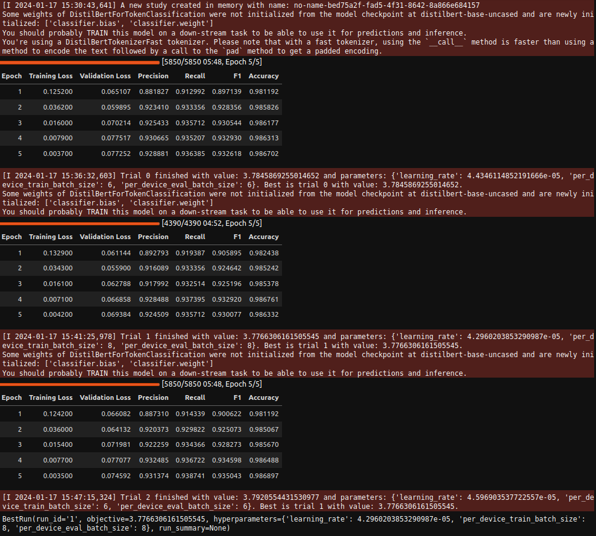

# Training the Final Model

We now have the best parameters, so let's train one last time. We'll need to set stuff up a little bit differently for the real deal.

For starters, we now want to save our model. Primarily, we'll now save checkpoints at each epoch, especially since we'll only do 5 epochs. I do early stopping here just to show how it's used really. 

The upsides of saving checkpoints is we can look at the training logs and pick out which checkpoint performed best and avoid overfitting.

```
In:
training_args = TrainingArguments(
    output_dir="../models/holding_zone",
    learning_rate=best_parameters['learning_rate'],
    per_device_train_batch_size=best_parameters['per_device_train_batch_size'],
    per_device_eval_batch_size=best_parameters['per_device_eval_batch_size'],
    num_train_epochs=5,
    weight_decay=0.01,
    logging_strategy="epoch",
    evaluation_strategy='epoch',
    metric_for_best_model="eval_loss",
    push_to_hub=False,
    remove_unused_columns=False,
    save_strategy="epoch",
    save_total_limit=5,
    load_best_model_at_end=True
)

trainer = Trainer(
    model=None,
    args=training_args,
    train_dataset=tokenized_ds["train"].remove_columns(["id", "tokens", "ner_tags"]),
    eval_dataset=tokenized_ds["validation"].remove_columns(["id", "tokens", "ner_tags"]),
    compute_metrics=compute_metrics,
    tokenizer=tokenizer,
    model_init=model_init,
    data_collator=data_collator,
    callbacks = [EarlyStoppingCallback(early_stopping_patience=3)]
)

trainer.train()
```

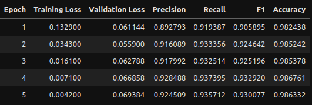

## Training Evaluation

Let's pretend we didn't have only 5 epochs and needed to gauge how this performed. We can utilize the training logs to create some dataframes and visualizations! 

### Creating Log Dataframe

```
In:
import pandas as pd

train_logs = []
valid_logs = []
for index, x in enumerate(trainer.state.log_history):
    if 'loss' in x.keys():
        train_logs.append(x)
    elif 'eval_loss' in x.keys():
        valid_logs.append(x)
    else:
        pass

train_logs = pd.DataFrame(train_logs)
valid_logs = pd.DataFrame(valid_logs)
logs = train_logs.merge(valid_logs, on=["epoch", "step"])

display(logs)
```

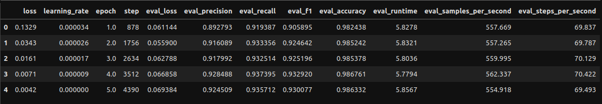

### Visualizing Logs

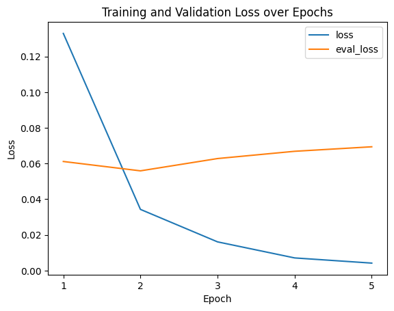

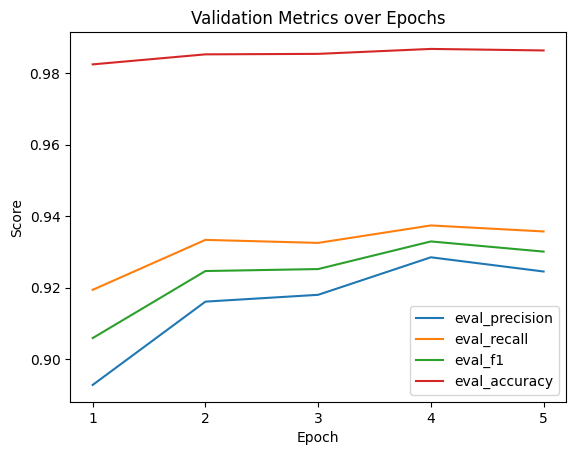

We'll go with epoch 2 as the metrics are perfectly high there and I want to avoid any potential overfitting from epochs 3 and on. Hard to gauge if it's genuinely overfitting due to the small number of epochs and how small all the loss scores are, but we'll play it safe. 

# Using the Model (Finally)

## Building the Pipeline

Pipelines are great when you can use them. Normally when you run predictions they're done on each and every token and require some cleanup, but pipelines handle prediction aggregation for you and provide some really clean output.

```
from transformers import pipeline

checkpoint = 1756 # Checkpoint for epoch 2.
model_dir = f"../models/holding_zone/checkpoint-{checkpoint}"
model = AutoModelForTokenClassification.from_pretrained(model_dir)
tokenizer = AutoTokenizer.from_pretrained(model_dir)
aggregation_strategy = "average"
pipe = pipeline(
    task="token-classification", model=model, tokenizer=tokenizer, aggregation_strategy=aggregation_strategy
)
```

Here we'll run some predictions and add some extra information for context. The dictionaries at the bottom are the real output of the pipeline.

```
In:
for index, row in enumerate(tokenized_ds["test"]):
    if index < 5:
        text = " ".join(row["tokens"])
        othertags = [id2label[id] for id in row["ner_tags"]]
        
        # Note that this is the only line you actually need to use the pipe. The rest is for context.
        pipe_output = pipe(text)
        
        print(f"Row: {index}")
        print(f"Transaction: {text}")
        print(f"Actual NER tags: {othertags}")
        for output in pipe_output:
            print(output)
        print("\n")
```

```
Out:
Row: 0
Transaction: SOCCER - JAPAN GET LUCKY WIN , CHINA IN SURPRISE DEFEAT .
Actual NER tags: ['O', 'O', 'B-LOC', 'O', 'O', 'O', 'O', 'B-PER', 'O', 'O', 'O', 'O']
{'entity_group': 'LOC', 'score': 0.99867, 'word': 'japan', 'start': 9, 'end': 14}
{'entity_group': 'LOC', 'score': 0.99866974, 'word': 'china', 'start': 31, 'end': 36}


Row: 1
Transaction: Nadim Ladki
Actual NER tags: ['B-PER', 'I-PER']
{'entity_group': 'PER', 'score': 0.89792097, 'word': 'nadim ladki', 'start': 0, 'end': 11}


Row: 2
Transaction: AL-AIN , United Arab Emirates 1996-12-06
Actual NER tags: ['B-LOC', 'O', 'B-LOC', 'I-LOC', 'I-LOC', 'O']
{'entity_group': 'LOC', 'score': 0.95205337, 'word': 'al - ain', 'start': 0, 'end': 6}
{'entity_group': 'LOC', 'score': 0.99500734, 'word': 'united arab emirates', 'start': 9, 'end': 29}


Row: 3
Transaction: Japan began the defence of their Asian Cup title with a lucky 2-1 win against Syria in a Group C championship match on Friday .
Actual NER tags: ['B-LOC', 'O', 'O', 'O', 'O', 'O', 'B-MISC', 'I-MISC', 'O', 'O', 'O', 'O', 'O', 'O', 'O', 'B-LOC', 'O', 'O', 'O', 'O', 'O', 'O', 'O', 'O', 'O']
{'entity_group': 'LOC', 'score': 0.9985221, 'word': 'japan', 'start': 0, 'end': 5}
{'entity_group': 'MISC', 'score': 0.98925483, 'word': 'asian cup', 'start': 33, 'end': 42}
{'entity_group': 'LOC', 'score': 0.9985801, 'word': 'syria', 'start': 78, 'end': 83}


Row: 4
Transaction: But China saw their luck desert them in the second match of the group , crashing to a surprise 2-0 defeat to newcomers Uzbekistan .
Actual NER tags: ['O', 'B-LOC', 'O', 'O', 'O', 'O', 'O', 'O', 'O', 'O', 'O', 'O', 'O', 'O', 'O', 'O', 'O', 'O', 'O', 'O', 'O', 'O', 'O', 'B-LOC', 'O']
{'entity_group': 'LOC', 'score': 0.9985563, 'word': 'china', 'start': 4, 'end': 9}
{'entity_group': 'LOC', 'score': 0.9988122, 'word': 'uzbekistan', 'start': 119, 'end': 129}
```

Alright, now we can use the model. But how good is it really? Some of these predictions are good, others aren't, but eyeballing this stuff is always a terrible idea. Let's break out an evaluator.

# Test Split Evaluation

Here out setup is a bit different from building a trainer. We remake the pipe without aggregation as that can sometimes cause issues. We also allow the evaluator to convert our tokens into a full string. Nothing too crazy.

```
In:
from evaluate import evaluator

task_evaluator = evaluator("token-classification")
pipe = pipeline(
    task="token-classification", model=model, tokenizer=tokenizer
)

results = task_evaluator.compute(
    model_or_pipeline=pipe,
    data=tokenized_ds["test"],
    metric="seqeval",
    input_column="tokens",
    label_column="ner_tags",
    join_by=" "
)
results
```

```
Out:
{'LOC': {'precision': 0.9088182363527294,
  'recall': 0.908273381294964,
  'f1': 0.9085457271364317,
  'number': 1668},
 'MISC': {'precision': 0.7337837837837838,
  'recall': 0.7735042735042735,
  'f1': 0.753120665742025,
  'number': 702},
 'ORG': {'precision': 0.8,
  'recall': 0.8741721854304636,
  'f1': 0.8354430379746836,
  'number': 1661},
 'PER': {'precision': 0.9592986850344396,
  'recall': 0.9474335188620903,
  'f1': 0.9533291848164281,
  'number': 1617},
 'overall_precision': 0.8664719023887266,
 'overall_recall': 0.8927053824362606,
 'overall_f1': 0.8793930408999738,
 'overall_accuracy': 0.9754926240982018,
 'total_time_in_seconds': 85.87057160699987,
 'samples_per_second': 40.21168061863144,
 'latency_in_seconds': 0.024868396063423073}
```

Oh god that's a lot of stuff. Kinda makes your eyes glaze over huh? Let me clean this up.

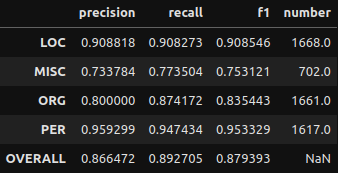

And some quick visualizations to go with it!

First I'll show the performance per entity, then I'll show how frequent each entity type is. The second plot I highly recommend examining as, especially in smaller datasets, not all entities will be as frequent as you may like. A smaller frequency of entities may result in the model giving extreme results for their metrics. Remember to not take metric results at face value.

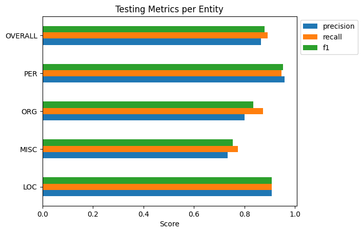

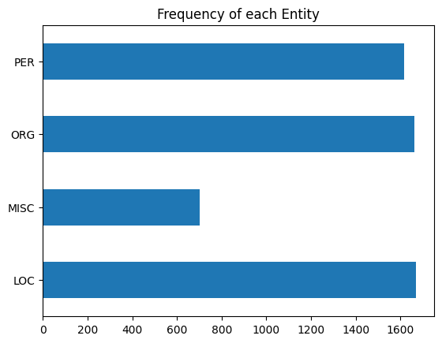

# Conclusion

And that's that really! This was a LONG writeup so thanks for sticking to the end. We covered a lot here so I hope even a fraction of the information presented was helpful. 

Next up, we'll be solving the problem of this model being stuck on your machine. We'll be talking deployment!