# Overview and Motivation

This write up is part 2 of 2 in a short series about fine tuning and deploying a large language model. In my [previous post](/p/named-entity-recognition-a-transformers-tutorial/) we fine tuned the model and learned how to use a transformers pipeline to run predictions for the named entity recognition downstream task. 

So now we have a large language model and it works, but what do we do with it? Currently it's trapped on our machine. What we need to do is create a web application and deploy that so our model can be accessed remotely! 

In many data science jobs it's common that we take a model, toss it over to a software engineer and let them deal with it. But understanding how to deploy your own work makes you a lot more versatile and can also help you understand how your tools are used in the first place. So not only do we get the ability to launch our own tools, we also become an even better team player with this knowledge! 

## A Quick Note

This writeup will not be covering how to setup an account on aws. That is outside the scope of this tutorial. I'll be covering what to do once you're already setup. 

## Isn't all of this information out there already?

Yes! All of the necessary information for this task can be found straight from the AWS Documentation. The issue here is I believe the documentation is overly cumbersome at times and I want a reference that makes it all a bit less overwhelming. I'm not the only one who thought this as well. Gastón Barbero wrote a guide I'll be borrowing from heavily. That guide can be found [here](https://medium.com/latinxinai/deploying-custom-inference-images-on-sagemaker-the-easy-way-13d760a690e4) and I highly recommend it as a reference. My guide will be slightly different and expand upon some of the parts I personally needed some extra help on. In particular, I'll also be showing how to connect to a Sagemaker endpoint via Postman.

# Structure of our AWS Deployment

Before we get started it's best we understand how everything will be organized. We'll be leveraging 3 different Amazon services for this task so it's important we understand the *why* behind everything we'll be doing before we dive in. 

To do this, I created a diagram to hopefully help showcase how this will all fit together.

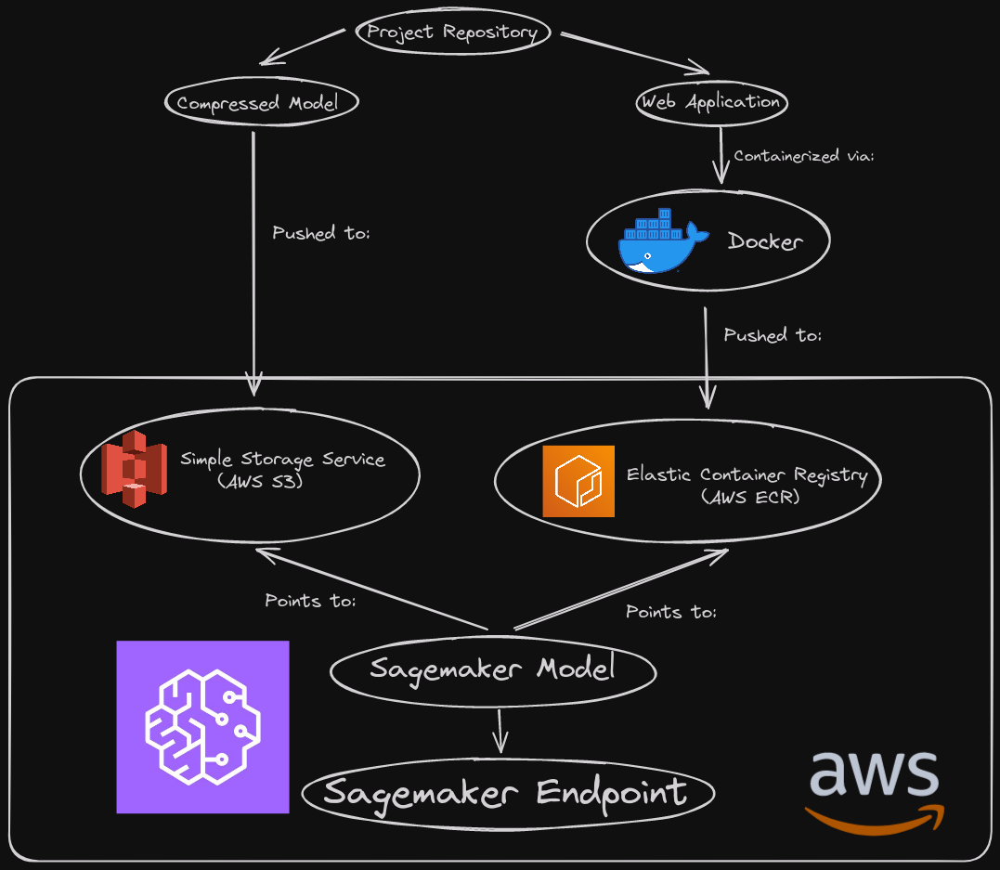

To briefly summarize, we'll be compressing the model we want to go with and hosting it on AWS S3. Our web application will live elsewhere, as a containerized docker image living on AWS ECR. This took me a while to wrap my head around at first, but it'll make more sense when we see how Sagemaker wants to setup a model on its end. Anyway, we use Sagemaker to link these two things together as a model and then host it via an endpoint! 

Bit awkward at first, but once you wrap your head around what Sagemaker wants it's not too bad!

First, let's get our model living on S3.

# The Model

## Compressing the model

Note that this section assumes you've already got a model. I'll be using a pytorch based Transformer fine tuned from distilbert. Refer back to my previous post if you're lost. 

So, last time I decided I'd be going forward with the **checkpoint 1756** model so we'll be compressing that.

```
cd models/holding_zone/checkpoint-1756
tar zcvf model.tar.gz *
```

To explain what the `tar` command does:
  
  * `tar` is a compression command in bash.
  * `z` compresses the archive using gzip, which I believe is required for S3.
  * `c` stands for create, so it tells tar to create a new archive.
  * `v` stands for verbose. Shows more details during archival process
  * `f` stands for the filename of the new archive. You follow f with the filename, which in this case is model.tar.gz.
  * `*` tells it to use everything in the current directory. 
  
Also, for reference, here is how my model directory looks.
 
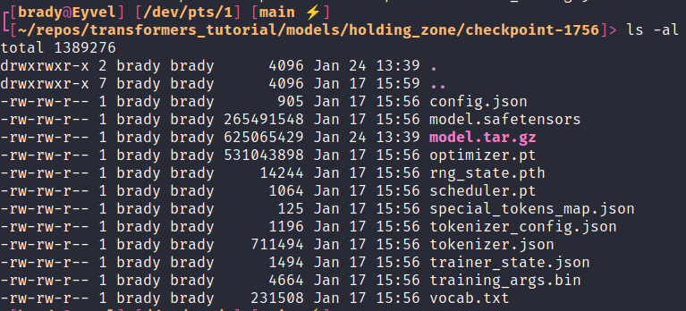
  
## Move Model to S3

You have a couple options here. You can use either use the UI on S3 itself or the command line. I'll show both methods because why not.

This is as simple as making a bucket for the model and then uploading the archive.



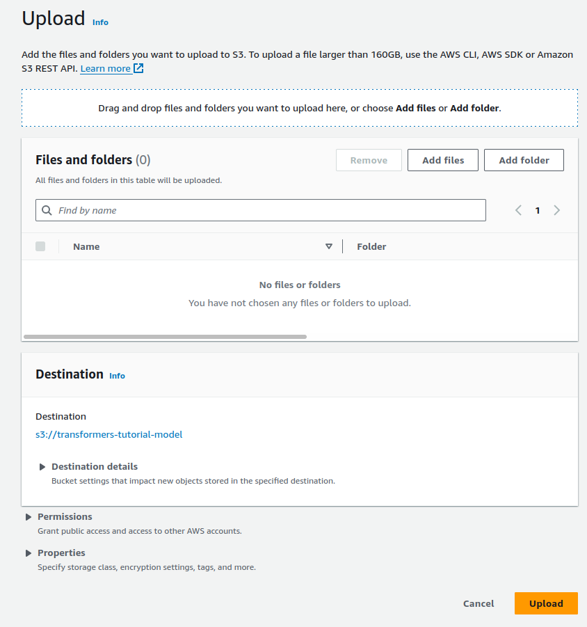

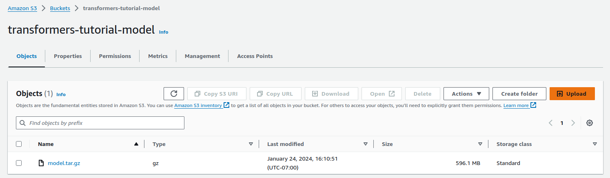




If you opt to use the command line instead, once you're logged in it's as simple as

```
  aws s3 cp <archive_path> s3://<bucket_name>
```

And that's it! Now onto the bulk of the work.

# The Web Application

So now that the model is up we need to create an application that can actually use it. This is where I got lost in the weeds when I first learned this. I had made many web applications before, but the docs here got a bit dense (for me). 

Essentially we need to organize our web application such that the [sagemaker inference toolkit](https://github.com/aws/sagemaker-inference-toolkit) is satisfied. Sagemaker will do a ton of stuff automatically, so our job is to make sure it can access everything in a way it expects. This is where Gastón's guide really saved me, as Amazons recommendation is a little... much.



```
# Copyright 2019-2020 Amazon.com, Inc. or its affiliates. All Rights Reserved.
#
# Licensed under the Apache License, Version 2.0 (the "License"). You
# may not use this file except in compliance with the License. A copy of
# the License is located at
#
#     http://aws.amazon.com/apache2.0/
#
# or in the "license" file accompanying this file. This file is
# distributed on an "AS IS" BASIS, WITHOUT WARRANTIES OR CONDITIONS OF
# ANY KIND, either express or implied. See the License for the specific
# language governing permissions and limitations under the License.
from __future__ import absolute_import

import os

import torch
from sagemaker_inference import (
    content_types,
    decoder,
    default_inference_handler,
    encoder,
    errors,
    utils,
)

INFERENCE_ACCELERATOR_PRESENT_ENV = "SAGEMAKER_INFERENCE_ACCELERATOR_PRESENT"
DEFAULT_MODEL_FILENAME = "model.pt"


class ModelLoadError(Exception):
    pass


class DefaultPytorchInferenceHandler(default_inference_handler.DefaultInferenceHandler):
    VALID_CONTENT_TYPES = (content_types.JSON, content_types.NPY)

    @staticmethod
    def _is_model_file(filename):
        is_model_file = False
        if os.path.isfile(filename):
            _, ext = os.path.splitext(filename)
            is_model_file = ext in [".pt", ".pth"]
        return is_model_file

    def default_model_fn(self, model_dir):
        """Loads a model. For PyTorch, a default function to load a model only if Elastic Inference is used.
        In other cases, users should provide customized model_fn() in script.

        Args:
            model_dir: a directory where model is saved.

        Returns: A PyTorch model.
        """
        if os.getenv(INFERENCE_ACCELERATOR_PRESENT_ENV) == "true":
            model_path = os.path.join(model_dir, DEFAULT_MODEL_FILENAME)
            if not os.path.exists(model_path):
                raise FileNotFoundError("Failed to load model with default model_fn: missing file {}."
                                        .format(DEFAULT_MODEL_FILENAME))
            # Client-framework is CPU only. But model will run in Elastic Inference server with CUDA.
            try:
                return torch.jit.load(model_path, map_location=torch.device('cpu'))
            except RuntimeError as e:
                raise ModelLoadError(
                    "Failed to load {}. Please ensure model is saved using torchscript.".format(model_path)
                ) from e
        else:
            device = torch.device("cuda" if torch.cuda.is_available() else "cpu")
            model_path = os.path.join(model_dir, DEFAULT_MODEL_FILENAME)
            if not os.path.exists(model_path):
                model_files = [file for file in os.listdir(model_dir) if self._is_model_file(file)]
                if len(model_files) != 1:
                    raise ValueError(
                        "Exactly one .pth or .pt file is required for PyTorch models: {}".format(model_files)
                    )
                model_path = os.path.join(model_dir, model_files[0])
            try:
                model = torch.jit.load(model_path, map_location=device)
            except RuntimeError as e:
                raise ModelLoadError(
                    "Failed to load {}. Please ensure model is saved using torchscript.".format(model_path)
                ) from e
            model = model.to(device)
            return model

    def default_input_fn(self, input_data, content_type):
        """A default input_fn that can handle JSON, CSV and NPZ formats.

        Args:
            input_data: the request payload serialized in the content_type format
            content_type: the request content_type

        Returns: input_data deserialized into torch.FloatTensor or torch.cuda.FloatTensor,
            depending if cuda is available.
        """
        device = torch.device("cuda" if torch.cuda.is_available() else "cpu")
        np_array = decoder.decode(input_data, content_type)
        tensor = torch.FloatTensor(
            np_array) if content_type in content_types.UTF8_TYPES else torch.from_numpy(np_array)
        return tensor.to(device)

    def default_predict_fn(self, data, model):
        """A default predict_fn for PyTorch. Calls a model on data deserialized in input_fn.
        Runs prediction on GPU if cuda is available.

        Args:
            data: input data (torch.Tensor) for prediction deserialized by input_fn
            model: PyTorch model loaded in memory by model_fn

        Returns: a prediction
        """
        with torch.no_grad():
            if os.getenv(INFERENCE_ACCELERATOR_PRESENT_ENV) == "true":
                device = torch.device("cpu")
                model = model.to(device)
                input_data = data.to(device)
                model.eval()
                with torch.jit.optimized_execution(True, {"target_device": "eia:0"}):
                    output = model(input_data)
            else:
                device = torch.device("cuda" if torch.cuda.is_available() else "cpu")
                model = model.to(device)
                input_data = data.to(device)
                model.eval()
                output = model(input_data)

        return output

    def default_output_fn(self, prediction, accept):
        """A default output_fn for PyTorch. Serializes predictions from predict_fn to JSON, CSV or NPY format.

        Args:
            prediction: a prediction result from predict_fn
            accept: type which the output data needs to be serialized

        Returns: output data serialized
        """
        if type(prediction) is torch.Tensor:
            prediction = prediction.detach().cpu().numpy().tolist()

        for content_type in utils.parse_accept(accept):
            if content_type in encoder.SUPPORTED_CONTENT_TYPES:
                encoded_prediction = encoder.encode(prediction, content_type)
                if content_type == content_types.CSV:
                    encoded_prediction = encoded_prediction.encode("utf-8")
                return encoded_prediction

        raise errors.UnsupportedFormatError(accept)
```



For someone with a bit more experience I'm sure this is perfectly reasonable to parse. For me though? We can do better. It's actually comical how much more simple we can make this. Better? Almost certainly not. Easier to understand? I think so.

## My Repository Structure

[Repository Link](https://github.com/blamson/transformers_tutorial)

Let me show you how my repository is organized. Note that this only includes stuff that'll be relevant to the web application. My `notebooks` and `models` directories are absent from here for instance.

```
├── src
│   ├── __init__.py
│   └── inference.py
├── modules
│   ├── __init__.py
│   └── helpers1.py
│   └── helpers2.py
│   └── ...
├── Dockerfile
├── .dockerignore
├── app.py
└── requirements.txt
```

First gonna discuss `src/inference.py` and then `app.py`. The `modules` directory just contains any helper functions I may need, it isn't necessary.

## inference.py

This file is where we'll define two functions, `load_model()` and `predict()`. They can be as simple or as ridiculous as you wish.

Let me show a basic skeleton of what you'll want.

```
from transformers import AutoTokenizer, AutoModelForTokenClassification, pipeline, Pipeline

def load_model(model_dir: str) -> Pipeline:
    """
    Loads the model and tokenizer from directory, moves them to a pipeline object
    """

    tokenizer = AutoTokenizer.from_pretrained(model_dir)
    model = AutoModelForTokenClassification.from_pretrained(model_dir)
    pipe = pipeline(
        task="token-classification", model=model, tokenizer=tokenizer, aggregation_strategy="average"
    )

    return pipe


def predict(data: list, pipe: Pipeline) -> list:

    predictions = pipe(data)

    return predictions
```

Ahhh, that's more like it! Now, of course this is just a rough skeleton. You'll need to add some more stuff depending on your needs but this is the bare minimum. I'd highly recommend some logging in particular to help with the debugging process on the cloud. In particular I recommend timing the different steps to help you recognize bottlenecks on the cloud. I only didn't include this stuff here to keep this snippet as to-the-point as possible. 

I'm pretty sure (source: trust me) that these function names ARE important. But otherwise you can do your thing. For example, we actually need to tweak the `predict` function so that it handles a little quirk.

### Quick Tangent: Stupid transformers pipe bug

Pipe, as we covered last time, returns a bunch of information related to each prediction. One of those is a confidence score that's a float. Small issue, for some reason it's a float 32 which isn't json serializable. So, uh, need to fix that. 

```
from typing import List


def make_pipe_play_nice_with_jsonify(predictions: List[dict]) -> List[dict]:
	"""
	Fixes the dumb issue where pipe outputs a float32 which isn't json serializable.
	"""

	for entity_prediction in predictions:
		entity_prediction.update({"score": float(entity_prediction["score"])})

	return predictions
```

```
def predict(data: list, pipe: Pipeline) -> list:

    logger.info("Running predictions")
    pipe_output = pipe(data)
    predictions = [make_pipe_play_nice_with_jsonify(text_prediction) for text_prediction in pipe_output]
    logger.success("Predictions completed")

    return predictions
```

Okay cool, sick. Moving on.

## app.py

This one is also quite simple. We need this script to do a few things.

1. Set up the app.
2. Load the model
3. Set up our two routes.
    * `/ping`
      - Sagemaker just needs this to be extremely basic. I return "pong".
    * `/invocations`
      - This handles taking in the request, processing it and returning the final output.
      
Here's how mine looks for this basic tutorial.

```
# imports
import os
import json
from src.inference import load_model, predict
from flask import Flask, request, jsonify
from modules import schemas

app = Flask(__name__)
pipe = load_model(os.environ["SM_MODEL_DIR"])


@app.route("/ping", methods=["GET"])
def ping():
    """
    Sanity check
    """

    return "pong"


@app.route("/invocations", methods=["POST"])
def invocations():
    """
    Handles prediction requests
    """

    body: dict = request.json

    if schemas.validate_request(body):
        data = body["strings"]
    else:
        error_response: dict = {
            "error": "Invalid Request",
            "message": "Invalid input format."
        }

        return jsonify(error_response), 400

    predictions: list = predict(data, pipe=pipe)
    output: str = json.dumps(predictions, indent=4)

    return output
```

And that's all you need there really. Even that schema validation isn't necessary. Add any extra bells and whistles where you see appropriate. Note that you'll want to setup some functionality for local testing of the app. Way faster to troubleshoot locally than on the cloud. *Trust me. Fight all temptation to cowboy code.*

## Dockerfile

Alright, let me just show you my Dockerfile and then I'll break it down.

```
FROM python:3.11
LABEL authors="brady_lamson"

WORKDIR /app

COPY requirements.txt .

RUN apt update && pip3 install --no-cache-dir -r requirements.txt \
  && pip3 install torch --index-url https://download.pytorch.org/whl/cpu \
  && pip3 install multi-model-server sagemaker-inference

COPY . .

ENV SM_MODEL_DIR /opt/ml/model

ENTRYPOINT ["gunicorn", "-b", "0.0.0.0:8080", "app:app", "-n"]
```

Some notes:

1. Sagemaker specifies the necessary work directory, so we set that first. 
2. I have torch set as a dev dependency and exclude it from our requirements so we can install the cpu version for our container instead.
3. I install the `multi-model-server` as it's actually a requirement for the inference toolkit. 
4. I utilize a very simple `.dockerignore` file so I can just use `COPY . .` while excluding unneeded directories.
5. I use `ENTRYPOINT` as it's what Sagemaker wants and within it I provide the command to setup all of our gunicorn stuff. 

## Move Application to ECR

First we need to setup a repository for our image. You'll want to log into the aws console online, go to elastic container registry and create a repository. On the user interface you'll see a URI, we'll need that. 

From here we move to our command line and run a bunch of commands.

```
sudo docker build -t <tag_name>

# log in to ecr (good for 12 hours)
`aws ecr get-login-password --region <region> | sudo docker login --username AWS --password-stdin <ecr URI>`

# Connect docker image to ecr
sudo docker tag <image_name>:<tag_name> <ECR URI>

# push to ecr
sudo docker push <ECR URI>
```

And that's it! Assuming everything worked we're now fully on AWS from here. 

# AWS Sagemaker

Sagemaker is a lot to take in if you've never been on it. It is full of functionality that we will thankfully not be using! If you look at the sidebar in Sagemaker, we'll be living entirely in the Inference section.

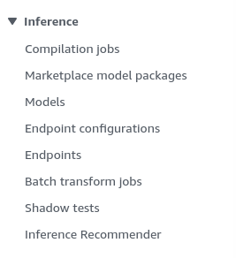

## Role Permissions (AWS IAM)

Before we do this you'll want to move over to Identity and Access Management (IAM) and create a role that has access to both Sagemaker and S3. To keep it simple, you can simply provide the permissions `AmazonS3FullAccess` and `AmazonSageMakerFullAccess` and you'll be good to go. Though, take note that in an actual organization your permissions may be a lot more strict. I called my role `data-scientist-full-access`.

## Sagemaker Models

Go on over to models and click `create_model` and go through the process. You're going to provide the location information for your app and model from ECR and S3 respectively. They should have a button to copy straight from those respective services.



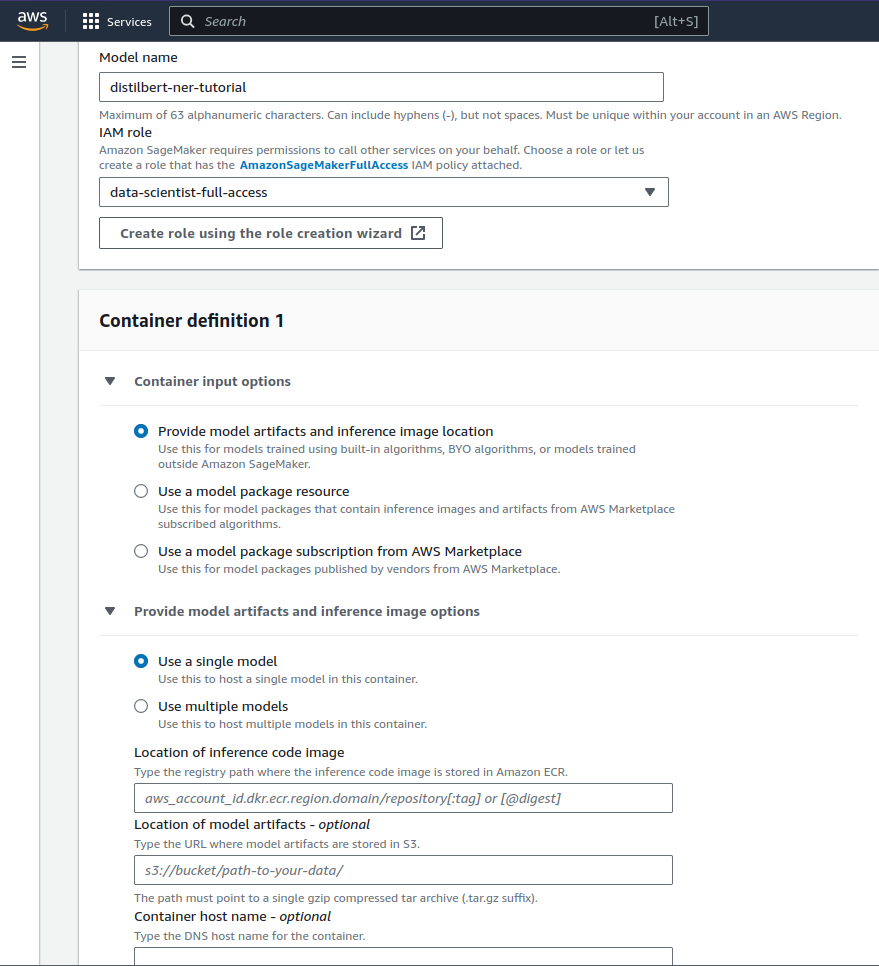




From here, simply click "create model" and you're good to go. 

## Create Endpoint

Going back to models, you can click on your new model and see that you can create a endpoint. Do so. Provide a name and select "create a new endpoint configuration". Here we'll select serverless. Essentially this is a low cost endpoint that only spins up when it's under use. So you don't incur as much cost if it's infrequently accessed and idling. For some reading on serverless inference, [here ya go](https://docs.aws.amazon.com/sagemaker/latest/dg/serverless-endpoints.html).

Next we're going to select "create production variant" and select our model. After creating the variant, you'll see that you can edit it. We'll need to do so. You can change the name, memory size and max concurrency. 

Memory Size will be dependent on how large of requests you'll be taking in and price you're willing to pay and Max Concurrency is capped at 10 for serverless endpoints. 

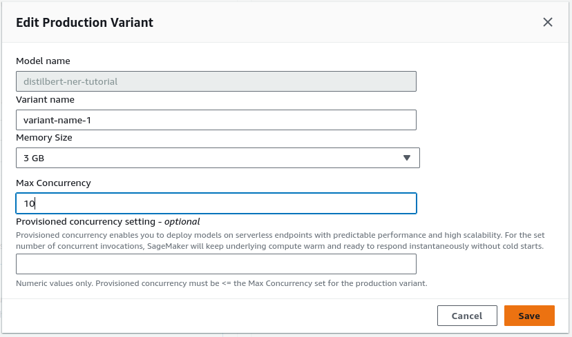

Anyway, from there create the endpoint. It'll take a while to spin up but assuming everything went well it should be in service! 

Here's what the endpoint will look like once it's created and running.

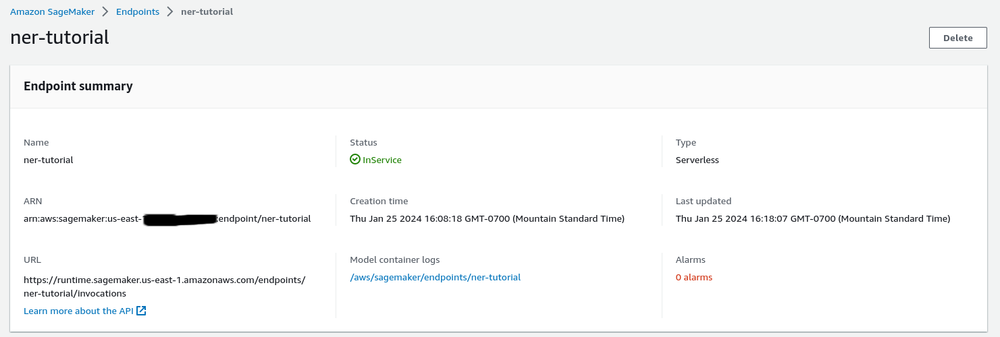

Note the model container logs, you'll want to check these frequently as you use the endpoint. If your endpoint breaks at all or is performing strangely, the logs will contain what you need to know (if you wrote good logs).

Okay, so the endpoint is up. Let's access it!

# Sending Requests via Postman

If you've never used Postman before it's a fantastic platform for testing APIs! We can send requests through it and make sure they work as anticipated. 

We'll need to do a few quick things to wrap this up. First, setup an environment to hold our access tokens. Second, Set up the authentication headers and lastly send out a request! 

## Environment Setup

On the left sidebar we can setup a new global environment. Here you'll include both of your AWS access keys that you can reuse as variables. This is recommended so you aren't just pasting your secret keys all over the place. 

Here's an example.

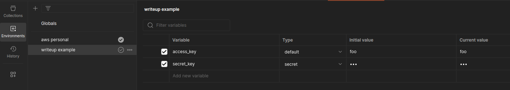

## Request Setup

Now we can use those variables we setup. In the top right of your window you should see an environment drop drown menu. Select the environment that contains your access keys.

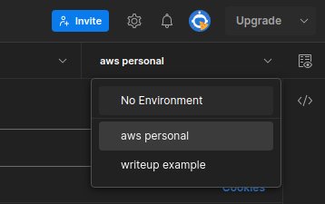

Next, on the top bar create a new request. Remember those endpoint details from when we built the endpoint? There's a URL in that window, you'll be pasting that into the request URL. 

Now click on Authorization. Here we'll set `Type` to `AWS Signature` and paste our key variables. Also go into Advanced configuration and set your AWS region and service. 

Here's how it'll look when you're done.

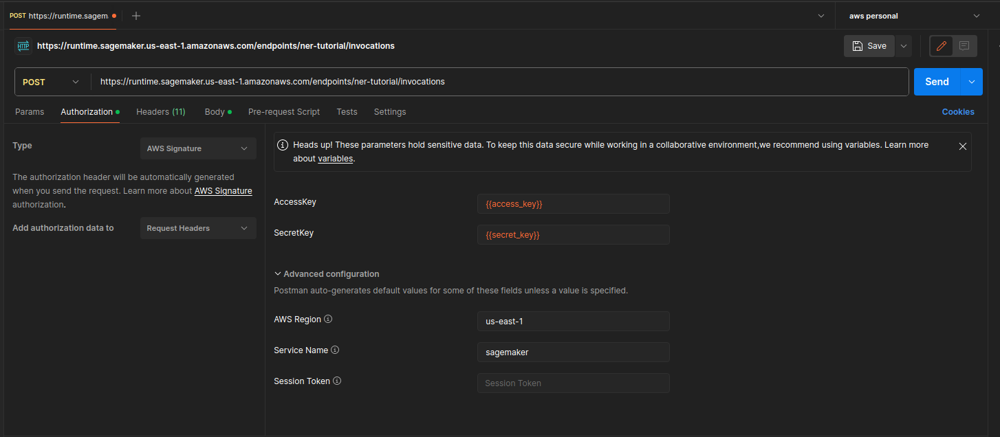

## Send a Request

Lastly we'll go to body and this is where the request lies. If you want to paste raw json into here you can and what I'll do for a demo. You can also send in entire files using the binary option.

Alright, let's see how this works with my endpoint! We'll use some text from the [Resident Evil Wiki](https://residentevil.fandom.com/wiki/Leon_Scott_Kennedy) for fun.

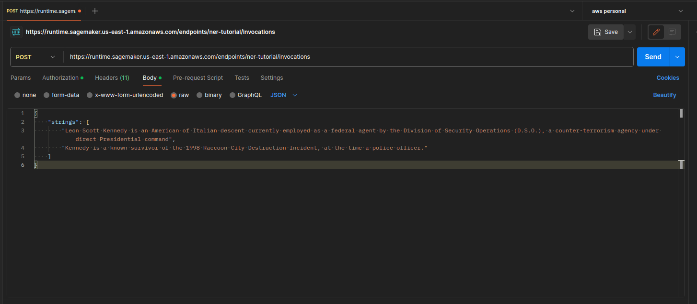

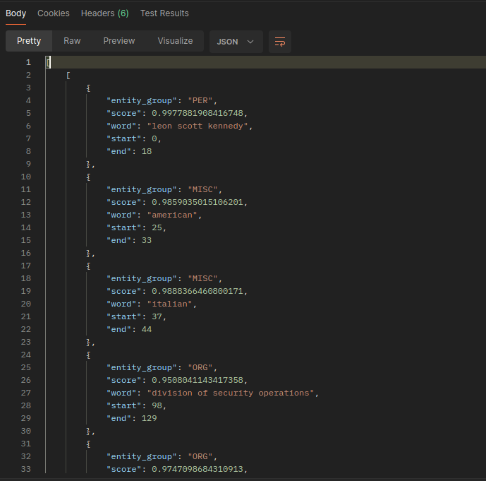

# Conclusion

And that's that! Hopefully this helps demystify the process a bit. I know there's a lot of room for improvement here but you gotta start somewhere. From here there is a lot we could do. Setting up training via the cloud, maybe using github actions so you can trigger training whenever the training dataset is updated, all sorts of stuff. AWS is so vast; there's always more to learn and I've definitely only just gotten started. 