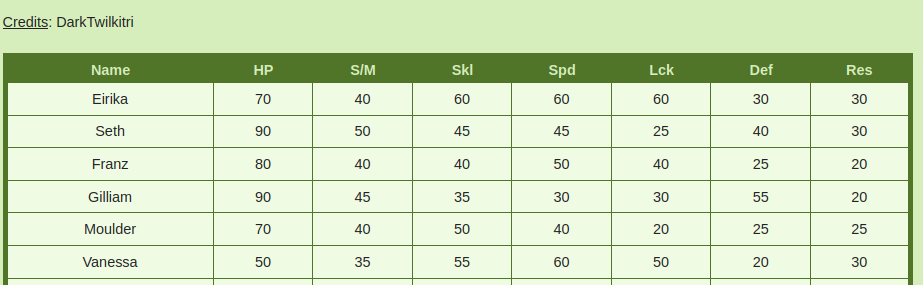
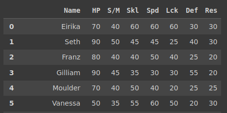
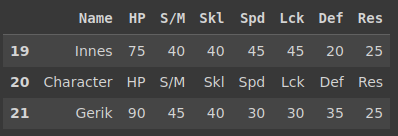
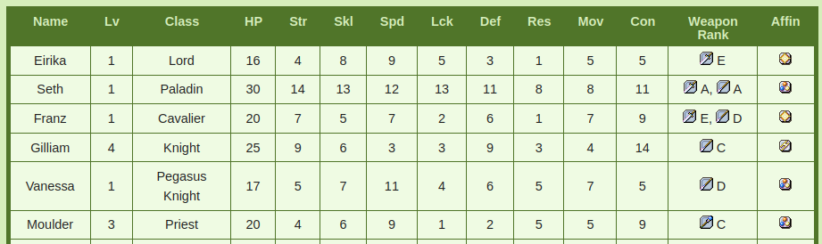
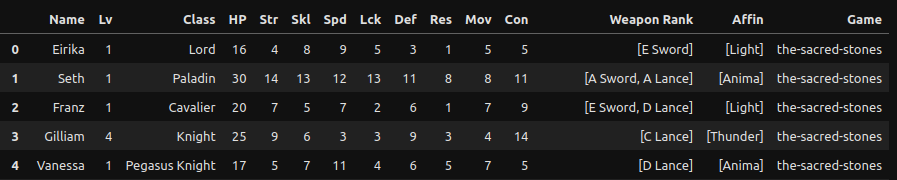
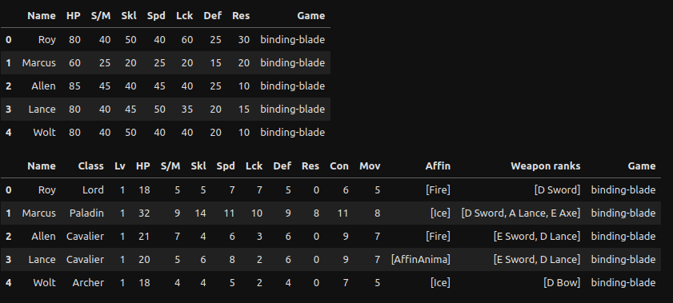

Every proper data science project begins at the same point. The data. Either that data doesn't exist at all and needs to be collected, or it exists but is somewhere inconvenient. My case is the latter.

This project is about the video game franchise Fire Emblem. It a series of war video games built on numbers. Everything, from combat outcomes to character stats, is determined by dice rolls of varying complexity. Characters, weapons, enemies, all have dozens of possible metrics and stats to examine. 

A lot of that information is hidden from the player and is unavailable in-game as well. Thankfully, the fine people at [Serenes Forest](https://serenesforest.net/) have compiled hundreds of tables containing every possible number you may want. 

This abundance of tables is a blessing and a curse however, as combining information from there requires having numerous tabs open. And, of course, we can't generate insights from that data as it is trapped on html tables. And so, in comes everyones *favorite* means on data collection, web scraping.

This article will, without a doubt in my mind, be updated as the project progresses. This will serve primarily as a journal containing my battle with all the html demons on this site. As the projects scope expands, more tables will need to be scraped. And with more tables comes more headaches. 

# Links to Repository and Notebook

[Repository](https://github.com/blamson/fire_emblem_app/tree/main)

[Notebook](https://github.com/blamson/fire_emblem_app/blob/main/notebooks/web_scraping.ipynb)

# Feb 9th, 2024: Naive Beginnings

Let us first examine what a usual table on this site looks like. We'll be examining the game Sacred Stones and extracting the "growth rates" of all the characters. That is, how likely they are to improve their stats on a level up. I'm starting with this table as it is quite simple.

Our url here is: https://serenesforest.net/the-sacred-stones/characters/growth-rates/



Nothing too scary here, reading this in and displaying it is a sinch. At least, at first glance.

```
url = "https://serenesforest.net/the-sacred-stones/characters/growth-rates/"
body = requests.get(url)
dataframes = pd.read_html(body.text)
for df in dataframes:
    display(df)
```



The first issue is a tricky one. You see, on the webpage they actually use multiple header rows for long tables so you don't lose sight of the columns. A consequence of this is that a naive way of reading in this table will just include it as another row. Check it out.



Not only is there another table header, it isn't even the exact same! So we need to address this immediately. We could fix this in post but this is a constant on this site so we'll want a more generalized solution.

Funfact: The variable `S/M` isn't even identical... the second one includes a white space afterwards. This is gonna be a long project huh?

Before I provide my solution, let's look at the other primary table we'll be wanting to pull down. 

## Base Stats Table: The Annoying One

Here we're extracting the "base stats" of all the characters. That is, the stats these characters join your army with.

Our url here is: https://serenesforest.net/the-sacred-stones/characters/base-stats/



Pretty simple at a glance but we've got more going on here. This page includes multiple headers as well as multiple tables. See, Sacred Stones features optional content after you beat the game which has a set of unlockable characters. This page separates them into two tables. Of note that the growth rates table does not do this. Because the demons have my soul under siege and I am trapped without food or water to weather the storm on my heart.

The weapon rank and affinity columns will also be awkward, as I don't intend to save the images and will instead need to extract text representing what they are. On the bright side, the url makes sense for both growth rates and base stats. `serenesforest.net/<game_title>/<table>/` I can work with this. 

Using **BeautifulSoup** and some creativity we can handle all of these issues.

### Image Columns

First, let's examine these images. What in the world do we do here? We don't want to save the images but for weapon ranks that would give us two letters and for affinity that leaves us with nothing. 

We'll use the row for Seth as an example as he has two weapon ranks.

```
Input:
url = "https://serenesforest.net/the-sacred-stones/characters/base-stats/"
page = requests.get(url)
soup = BeautifulSoup(page.content, "html.parser")
tables = soup.find_all("table")
seth = tables[0].find_all('tr')[2]
weapon_info = seth.find_all('td')[-2]
affinity = seth.find_all('td')[-1]
print(f"Weapon html: {weapon_info.prettify()}\n\nAffinity html: {affinity.prettify()}")
```

```
Output:
Weapon html: <td>
 <a href="https://serenesforest.net/wp-content/uploads/2014/04/TypeSword.gif">
  
 </a>
 A,
 <a href="https://serenesforest.net/wp-content/uploads/2014/04/TypeLance.gif">
  
 </a>
 A
</td>

Affinity html: <td>
 <a href="https://serenesforest.net/wp-content/uploads/2014/04/AffinAnima.gif">
  
 </a>
</td>
```

Within this nonsense are two things we can use. The "alt" image parameter and the cells actual text. Affinity is really easy, we just replace the image with it's alt text.

```
Input:
affinity_type = affinity.find('img')['alt']
affinity_type

Output:
'Anima'
```

Weapon is tricky. We want both the alt text and cell text, but we can have multiple weapons. This is a solution I came up with.

```
Input: 
weapon_types = weapon_info.find_all('img')
weapon_types = [weapon['alt'] for weapon in weapon_types]
ranks = weapon_info.text.replace(',', '').split()
print(f"Weapons: {weapon_types}\nRanks: {ranks}")

Output: 
Weapons: ['Sword', 'Lance']
Ranks: ['A', 'A']
```

And to combine them: 

```
Input:
weapon_ranks = [f"{ranks[i]} {weapon}" for i, weapon in enumerate(weapon_types)]
weapon_ranks

Output:
['A Sword', 'A Lance']
```

Not perfect. I'd really like to separate out the rank and weapon types at some point but I just need something basic at first.

## "Basic" Scraping Function

Combining all of this knowledge we can create a safer way of scraping these tables. We need to only take the first header and have handling for image cells.



```
def extract_alt_text(image_info):
    if image_info['alt']:
        return image_info['alt']
    return
```

```
def scrape_table(table, game_title: str) -> pd.DataFrame:
    """
    Designed to scrape web tables found on serenesforest
    Serenes frequently uses multiple table header rows so this function
        takes that into account
    Note that header_found here is important as sometimes header rows use SLIGHTLY
        different strings so this is the safest route I could come up with.
        I really only want the first row of headers per table.
    Function also accounts for cells containing images and extracts their alt text to use as data.
    """
    data = []
    columns = []
    header_found = False
    
    for index, row in enumerate(table.find_all('tr')):
        row_data = []
        if not header_found:
            headers = row.find_all('th')
            if headers:
                header_found = True
                columns = [header.text for header in headers]
    
        for cell in row.find_all('td'):
            images = cell.find_all('img')
            if images:
                cell_data = [extract_alt_text(image) for image in images]
                if cell.text:
                    text = cell.text.replace(',', '').split()
                    cell_data = [f"{text[i]} {alt_text}" for i, alt_text in enumerate(cell_data)]
                row_data.append(cell_data)
            else:
                row_data.append(cell.text)
    
        if row_data:
            data.append(row_data)
        
    df = pd.DataFrame(data, columns=columns)
    df['Game'] = game_title

    return df
```



I also include the game itself as a variable for later.

Here's what we get if we use this on the base stats table!



I don't like how everythings in a list but I'll deal with that later. This is a good starting point. Since this function takes in a single table, it's easy to apply such that we can clean up all of the tables on as a page as well. 

## Testing on a different game (Binding Blade)

As a test let's see if anything I wrote is even somewhat useful in a generalized sense.

```
Input:
game = 'binding-blade'
table_names = ['growth-rates', 'base-stats']
for table_name in table_names:
    url = f"https://serenesforest.net/{game}/characters/{table_name}/"
    dfs = table_to_df(url, game)
    for df in dfs:
        display(df.head(5))
```



## Feb 9 Thoughts

With this, I can start saving my data and thinking about how I want my eventual dashboard to look like. I want to get this data on Tableau asap so I can think of what standards I want to apply to everything moving forward. For that, something still a bit messy is fine. I know I've got a lot of stuff I have yet to consider for future games as well. I've seen some things and boy am I *scared*.