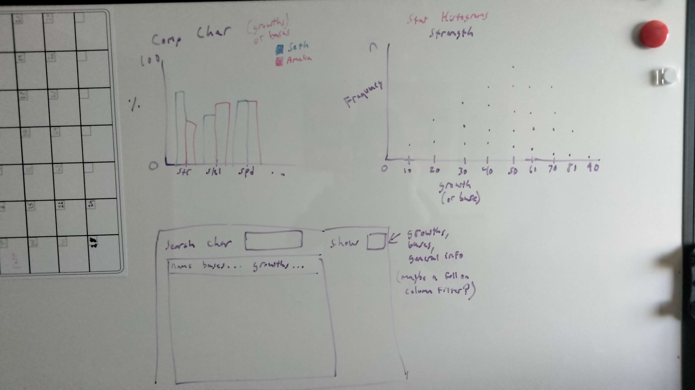
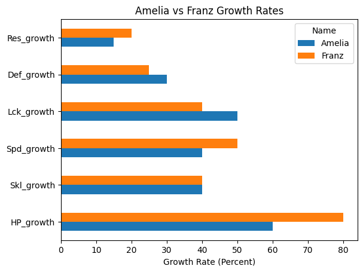
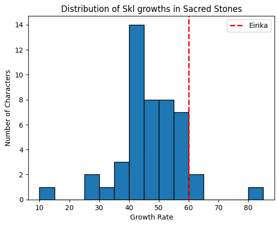
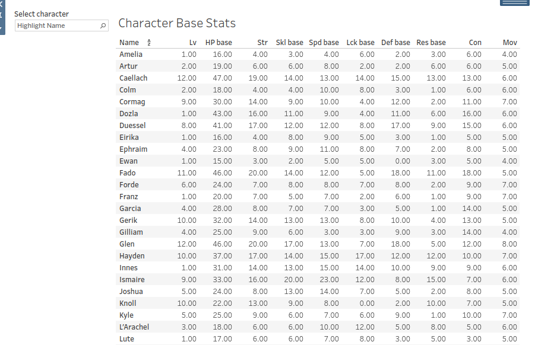
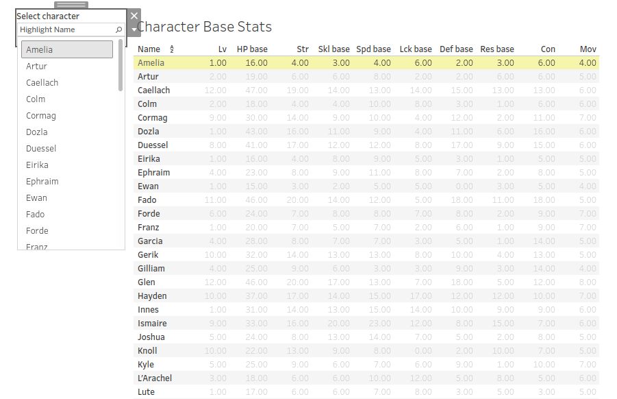

Okay, thanks to the work done in my [previous post](/p/fire-emblem-project-data-collection/) we now have some data to start messing around with. My goal here is to just write about some of my thoughts and ideas for an initial dashboard. Which means some whiteboard sketches and basic matplotlib visualizations to showcase where my heads at. 

# Motivation

Before we start it's important I make clear what my goal here is. When playing these game the tables themselves are often all you need. They're a quick reference most of the time and I want to embrace that. I think trying to build an overly colorful and fancy dashboard full of crazy visuals would actually make this *less* useful than just the tables on SerenesForest. Therefore I want the tables to be front and center and easy to navigate and filter. As for the visuals they should convey helpful information quickly and succinctly while providing some actual functionality one can't get just looking at a table. They should ideally feel like a helpful add-on and not something that feels like it's there just to show off.

# Whiteboard Sketches

Here's where my brain is at the start.



## The Table

Let's start with the bottom. It's just a simple view of the table but with stuff I think would be helpful. First would be a character selector. Most of the time you only care about one characters stats so this is a mandatory feature. This could work fine as a drop down or something you type in manually. I'll see which is easier to implement. Could also be helpful to be able to select more than one character.

Then we've got a column selector. My data *currently* is split into 3 separate tables. General information, growths and bases. I'm torn on implementation here. I can either create a selector like this to swap between them or create separate tabs entirely. This will largely depend on how the visualizations are formatted on  the dashboard alongside the tables. But, regardless, I want a way to easily move between tables and to select the information the user cares about.  This will largely depend on how I end up organizing all this data later on.

## Character Comparison Plot

This plot allows a visual comparison of two characters stats the user would select. I think this one is the most obviously useful and there isn't too much to explain here. This bar plot would allow for comparisons for either base stats or growths of course. Easy to make in python as well, though we'll see about Tableau. I should also allow functionality for one character and maybe consider more than two. 

## Individual Stat Histogram

This plot would simply showcase the distribution of specific stats. So strength, speed, skl, etc. An idea that isn't on this whiteboard sketch would be to show where a specific character lies on that distribution. That changes it from just some plot to something with actual utility. Again, should be a cinch to implement as well. At least, the first part is. 

# Python Proof of Concept Plots

Before we jump straight to a dashboard tool like Tableau or PowerBI I need to use what I know. Before this project I've never actually used a dashboarding tool so it's important I make the plots where my strengths lie first. 

## Character Comparison Plot

This one is pretty easy to set up. 


```
def plot_character_comparisons(name1: str, name2: str, df: pd.DataFrame, bases:bool = True):
    """
    Creates a side-by-side bar plot allowing for visual comparison of character stats.
    """

    if bases:
        suffix = 'base'
        title = 'Base Stats'
        x_label = ''
    else:
        suffix = 'growth'
        title = 'Growth Rates'
        x_label = 'Growth Rate (Percent)'

    # Data consistency here is important. This filter requires a stat to end with the suffix.
    stat_columns = [col for col in ss if col.endswith(suffix)]
    
    return (
        df
        [['Name'] + stat_columns]
        .loc[df['Name'].isin([name1, name2])]
        .set_index('Name')
        .T
        .plot(
            kind='barh',
            title=f'{name1} vs {name2} {title}',
            xlabel = x_label
        )
    )
    
plot_character_comparisons('Amelia', 'Franz', df=ss, bases=False)
```





The real nerds here will notice an issue with this plot. It's missing the strength stat! But why? Well, with how the data I have is currently set up and named the strength stat "S/M" is never given a suffix due to some annoying data inconsistency between the base and growth table. I'll need to address that going forward, but for now it's fine. Trying not to get lost in the weeds when I don't even know what the final structure of my data will be.

## Individual Stat Histogram

Here I followed through on my idea of showing where a character lies in the distribution. This was surprisingly not that hard to create. Here's hoping we can see the same ease in the BI software. We'll see if I go with a line in the end or something a bit nicer looking but this is, as always, just a proof of concept.



```
def stat_histogram(df: pd.DataFrame, stat:str, name:str, bases: bool = True):
    if bases:
        col = f"{stat}_base"
        version = 'base'
    else:
        col = f"{stat}_growth"
        version = 'growth'
    
    data = df[col]
    ax = plt.hist(data, bins=15, edgecolor='black')
    plt.title(f"Distribution of {stat} {version}s in Sacred Stones")
    plt.xlabel('Growth Rate')
    plt.ylabel('Number of Characters')

    if name:
        char_point = ss.loc[ss['Name'] == name, col].values[0]
        plt.axvline(x=char_point, color='r', linestyle='--', linewidth=2, label=f'{name}')
        plt.legend()

    return plt.figure()
    
stat_histogram(ss, stat='Skl', name='Eirika', bases=False)
```

I used a different method of writing the code here as there was no elegant way for me to add the character line within one method chain. Whenever I return to python for the plotly dashboard I'll be sure to standardize my implementation (it'll also no longer be in matplotlib). 





# Tableau Tinkering

As I mentioned I've never used a business intelligence tool before this project so I'm gonna need to go through a few tutorials before I tackle the plots, but at the very least I've got the tables up and running. I currently have them organized into separate tabs as I learn the various things I can do here but it's a start!





What would be really cool is to have the histogram automatically move the line around depending on which character is highlighted. I wonder how difficult that would be? Hmmmmm

# Conclusion

Next up I think I'll need to study up on Tableau and become more familiar with the basics. I feel like I'm floundering around in all of the GUI stuff right now. Seems like a really cool piece of kit though.