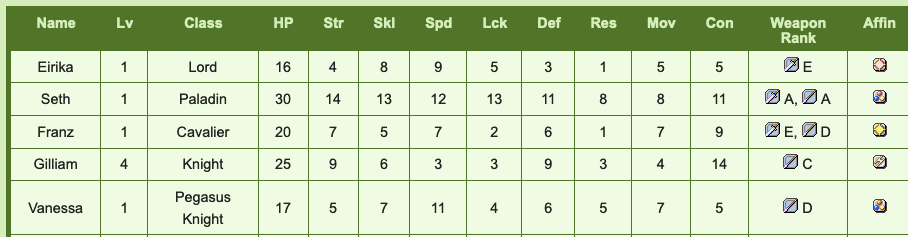
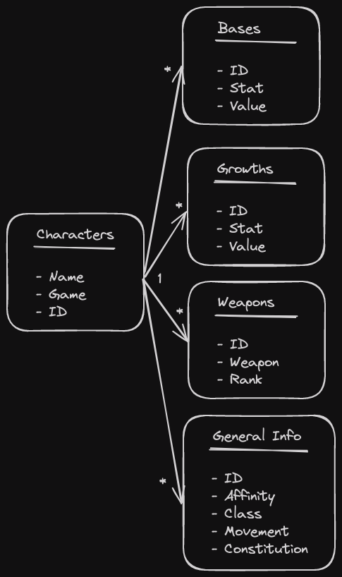

# Update!

It's been a while since my last update and there's a few reasons for that. Firstly, and primarily, is that the spiritual battle of me vs. unemployment has been a rocky one. As of this post I am nearing 4 full months on this journey and it's worn down on me. My motivation to work on projects had dulled substantially, and I had to take time away for a mental reset to regain my ability to work. Feeling a lot better now though and am enjoying the process again.

Secondarily, is that this project is quite a pain! We'll get into that here. However, I'm not here to *exclusively* whine. I'm here to provide some updates! Though I don't have an outright deliverable yet, I'm getting close. Figuring out how I want to organize this data has been an experience and I want to discuss how I'm going about it! This has been my first time ever organizing and architecting out a database myself and there's so much to discuss. 

# PowerBI

My last update was utilizing Tableau but I started tinkering with PowerBI shortly after and found it far more intuitive for me to use. Since the BI tooling is only for a proof of concept, I figured the easier to use tool would be the best call. It'll definitely only be sufficient for the basics and I'm excited to create some plots manually, but this helps me easily explore various data transformations and relationships. 

Honestly I owe a lot to PowerBI and actually quite like it! It's really helped me learn the basics of data architecting and I'm grateful for that.

# The Semantic Model

## The Issue

So let's talk data. Though I'm pulling tables directly from the web, they aren't necessarily in a format I can use for analysis. Tables designed exclusively for visual interpretation are different from those you'd use for actual computation. As such, I've had to learn a lot of lessons the hard way. I'm beginning to wonder if there's an *easy* way to learn anything at all! 

At first I was considering using relational data purely to force myself to build a database on my own, but I have now recognized the necessity of it here. These tables are full of stuff that works so much better as long formatted data which will necessitate various `1 to many` relationships. Let me provide an example. 

This is a segment of a table showcasing the base stats of a few characters from Fire Emblem The Sacred Stones. Wide format here doesn't hurt that bad here honestly, it's very readable. However, if you take a look over at the "Weapon Rank" column we'll see our first obvious issue. 

It's just a list of weapons and their corresponding ranks. This is no good. One character can have many weapons, throwing them all into a list like this is a very non-standard format and doesn't work for comparing this information at all. Not only that, the weapons are smushed in with the ranks which is even worse. So I had to make modifications here. Let's take a look at the same table that only includes information on weapons in a better format!

| Name | Weapon | Rank |
|---|---|---|
| Eirika | Sword | E |
| Seth | Sword | A |
| Seth | Lance | A |
| Franz | Lance | D |
| Franz | Sword | E |

This actually gives me something to work with. This kind of pre-processing and pivoting is something I'm having to do constantly here. On top of that, this data is messy. Part of my issue was trying to write code that could handle every single quirk, I've now changed my mind and am doing a lot of manual tailoring, sometimes even manual writing into a google sheet if a programatic solution is too much of a pain. I'll get to more streamlined generalized web scraping code once I've got an MVP done. 

Anyway, let's take a look at my current semantic model! 

## The Current Model

I've taken the wide format data from the base stats and growth rates table and have broken them down into a few long format tables. I've opted to avoid wide format tables when I can to get used to longer data, whether this is the right call for all of this data is to be seen.

Both the bases and growths tables utilize the exact same format, here's what I've opted for. This is what they look like.

| Name | Attribute | Value | creature_campaign |
|---|---|---|---|
| Amelia | HP | 16 | False |
| Amelia | Power | 4 | False |
| Amelia | Skill | 3 | False |
| Amelia | Speed | 4 | False |
| Amelia | Luck | 6 | False |

So each characters stat is a single row. I'm still torn on if this is a good idea or not, we'll find out! 

## Current Issues

So this current model isn't perfect. Let me address some of its failings and bring up what I'm currently building towards. 

1. **No unique identifier:** Some characters show up between multiple games and I really need to build a proper ID for each character. This will give me a far more reliable primary key. 
2. **Varying stats:** Some games like FE6 have characters whose stats vary between difficulty modes and have multiple rows in the original tables due to this. I currently have no way to properly handle for this outside of assuming each instance is just a different character. 
3. **Campaign Splits**: Similar to the difficulty issue is games where characters stats vary depending on some split in the campaign. FE7 has a lot of this, you've got 3 campaigns AND difficulty modifiers. 
4. **Bonus characters:** That's what "creature campaign" stands for but it's only unique to FE8. FE6 has no creature campaign but it has 8 bonus characters. These are characters that you get after you beat the game. We want to be able to exclude these characters as they have extremely high stats and will skew a lot of analysis, but I don't want to remove them entirely. I want to a way to handle them. Overall though, bonus characters are non-existent in most games. Where do I include this information in the model? I feel my current implementation is very redundant and bad.
5. **Non-Universal Stats**  Not every game has the same stats. Statistics like constitution and affinity for instance are constant across FE6-FE8, but aren't a given across the franchise. How will I handle that discrepancy so this won't bite me later?
6. **Missing Information:** My current model in PowerBI is excluding data for no real reason? Previously I had decided to excluded info like class, affinity, movement and constitution and need to create a table for this information.

### The Orson Example: Duplicate Characters

This Paladin from Sacred Stones is a great example of how awkward this data can be to work with. Orson joins the party early on in the game, but betrays them soon after and is no longer playable. However, he can be unlocked as a bonus character after the game is over. This guy kept triggering bugs for me. He has two sets of base stats, though his growths and weapon ranks are identical in both versions. You *need* handling for this guy as if you aren't careful his duplicated stats can combine together and provide erroneous information. This guy is what triggered the "creature_campaign" variable. 

I use him as an example as duplicate characters are common. The "hard mode" duplication issue is one I'm also struggling with. Let's see an example.

How the tables are scraped normally (for FE6) simply slaps HM onto the end of any hard mode variants. Thankfully they're labeled. I've come up with two strategies.

1. Treat the HM variants as a different character. Easy to implement, but feels sloppy as the growths and weapon ranks are identical. 
2. Create a hard mode variable. Temporarily works but FE7 will require yet another variant with campaign differences. So this feels short sighted. 

For #2, I'm wondering *where* I'd put the hard mode flag. In the bases and growths tables like in the creature campaign flag? That feels sloppy but I'm not sure if it's a bad idea. Should I really be separating stuff like this every time there's a weird quirk? There'll only be more of these as we go!

## (Slightly) Better Model

This model I'm working towards definitely doesn't sort everything out, but I think it's a good starting point. Let's take a look.

This new model uses character ID as the primary key and features a 1 to many relationship between all the tables stemming from a simple `Characters` table. This doesn't handle a variety of the issues I mentioned however. It solves issues #1 and #6, but issues 2 -> 4 are all still borked here. I really need to figure out how to handle these quirks in the data.

# The Dashboard

I was going to discuss the visualizations I had made recently but turns out a lot of my tinkering today has broken them! I'll make that its own separate write-up now or just edit this later! Yay!