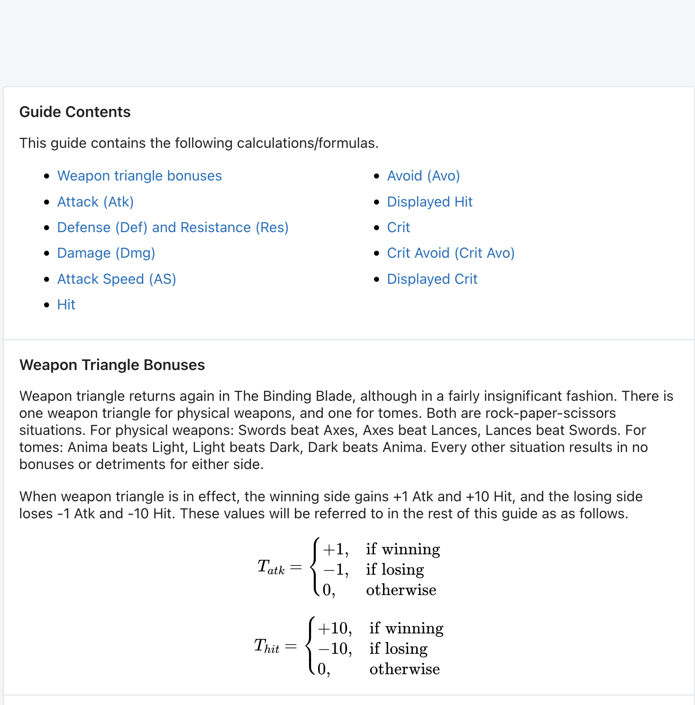

# Update!

It's been a while since my last update and there's a few reasons for that. Firstly, and primarily, is that the spiritual battle of me vs. unemployment has been a rocky one. As of this post I am nearing 4 full months on this journey and it's worn down on me. My motivation to work on projects had dulled substantially, and I had to take time away for a mental reset to regain my ability to work. Feeling a lot better now though and am enjoying the process again.

Secondarily, is that this project is quite a pain! We'll get into that here. However, I'm not here to *exclusively* whine. I'm here to provide some updates! Though I don't have an outright deliverable yet, I'm getting close. Figuring out how I want to organize this data has been an experience and I want to discuss how I'm going about it! This has been my first time ever organizing and architecting out a database myself and there's so much to discuss. 

# PowerBI

My last update was utilizing Tableau but I started tinkering with PowerBI shortly after and found it far more intuitive for me to use. Since the BI tooling is only for a proof of concept, I figured the easier to use tool would be the best call. It'll definitely only be sufficient for the basics and I'm excited to create some plots manually, but this helps me easily explore various data transformations and relationships. 

Honestly I owe a lot to PowerBI and actually quite like it! It's really helped me learn the basics of data architecting and I'm grateful for that.

# The Dashboard

Let's start with the fun stuff. Under the hood this is powered by the semantic model but that isn't *cool* and I only discuss *cool stuff* here on this site.

I've created a few basic visualizations so far. I'm not going to claim this dashboard is some achievement of graphic design. It's hideous. However, it's a proof of concept so I take pride in its hideousness. It's more about the function and learning how stuff plays together.

## Bases vs. Growths Scatterplot

The goal of this page is honestly just to show a neat visualization for where characters appear relative to the rest of the cast w/ regards to specific stats. You select an attribute and every character is shown on a scatterplot with a nice reference table below. 

### Annoying Quirks

There's a feature that *would* be neat where you can select a character from the table and it shows only that point on the plot. However, if you use auto plot boundaries you lose all perspective. What's irritating is that setting manual axis limits requires extremely high values due to some characters with exceptionally high (100%+) growth rates, making everything else suffer as a result. There's workarounds using PowerQuery but I'm trying not to peer into the void too deep yet, so I'll just deal with this bug. We'll be moving to Plotly Dash later anyway.

## Character Comparison

Okay this one's actually useful. My original vision for this visual was to allow for comparing two characters, but PowerBI is almost too intuitive and allows for arbitrary selection and, for the most part, handles it nicely in the visuals. I'm still working out the kinks of what I want to show here as I think this layout is hideous, but I think this page has a lot of potential for quick comparisons. 

### Annoying Quirks

If you accidentally double click a character to select it deselects them and creates a monster visual with every character included. This just makes the whole thing feel clunky and unprofessional. In Plotly I'll likely set this such that if nothing is selected it defaults to a standard 2 character comparison instead, Eirika vs. Ephraim as an example.

## Basic Data Tables

This one used to be a lot better but got worse as I altered the general model. I will show my work but also explain my goals. I intend to create a master table that includes everything in a giant wide format, allowing for an easy to navigate table for anyone who just needs that. For now I've got two wide stat tables that are missing a lot of useful general info that I need to reinclude. So this is what I've got for now. At the very least I've included a character filter to allow trimming the tables down to relevant characters.

# The Semantic Model

## The Issue

So let's talk data. Though I'm pulling tables directly from the web, they aren't necessarily in a format I can use for analysis. Tables designed exclusively for visual interpretation are different from those you'd use for actual computation. As such, I've had to learn a lot of lessons the hard way. I'm beginning to wonder if there's an *easy* way to learn anything at all! 

At first I was considering using relational data purely to force myself to build a database on my own, but I have now recognized the necessity of it here. These tables are full of stuff that works so much better as long formatted data which will necessitate various `1 to many` relationships. Let me provide an example. 

This is a segment of a table showcasing the base stats of a few characters from Fire Emblem The Sacred Stones. Wide format here doesn't hurt that bad here honestly, it's very readable. However, if you take a look over at the "Weapon Rank" column we'll see our first obvious issue. 

It's just a list of weapons and their corresponding ranks. This is no good. One character can have many weapons, throwing them all into a list like this is a very non-standard format and doesn't work for comparing this information at all. Not only that, the weapons are smushed in with the ranks which is even worse. So I had to make modifications here. Let's take a look at the same table that only includes information on weapons in a better format!

| Name | Weapon | Rank |
|---|---|---|
| Eirika | Sword | E |
| Seth | Sword | A |
| Seth | Lance | A |
| Franz | Lance | D |
| Franz | Sword | E |

This actually gives me something to work with. This kind of pre-processing and pivoting is something I'm having to do constantly here. On top of that, this data is messy. Part of my issue was trying to write code that could handle every single quirk, I've now changed my mind and am doing a lot of manual tailoring, sometimes even manual writing into a google sheet if a programatic solution is too much of a pain. I'll get to more streamlined generalized web scraping code once I've got an MVP done. 

Anyway, let's take a look at my current semantic model! 

## The Current Model

I've taken the wide format data from the base stats and growth rates table and have broken them down into a few long format tables. I've opted to avoid wide format tables when I can to get used to longer data, whether this is the right call for all of this data is to be seen.

Both the bases and growths tables utilize the exact same format, here's what I've opted for. This is what they look like.

| Name | Attribute | Value | creature_campaign |
|---|---|---|---|
| Amelia | HP | 16 | False |
| Amelia | Power | 4 | False |
| Amelia | Skill | 3 | False |
| Amelia | Speed | 4 | False |
| Amelia | Luck | 6 | False |

So each characters stat is a single row. I'm still torn on if this is a good idea or not, we'll find out! 

## Current Issues

So this current model isn't perfect. Let me address some of its failings and bring up what I'm currently building towards. 

1. **No unique identifier:** Some characters show up between multiple games and I really need to build a proper ID for each character. This will give me a far more reliable primary key. 
2. **Varying stats:** Some games like FE6 have characters whose stats vary between difficulty modes and have multiple rows in the original tables due to this. I currently have no way to properly handle for this outside of assuming each instance is just a different character. 
3. **Campaign Splits**: Similar to the difficulty issue is games where characters stats vary depending on some split in the campaign. FE7 has a lot of this, you've got 3 campaigns AND difficulty modifiers. 
4. **Bonus characters:** That's what "creature campaign" stands for but it's only unique to FE8. FE6 has no creature campaign but it has 8 bonus characters. These are characters that you get after you beat the game. We want to be able to exclude these characters as they have extremely high stats and will skew a lot of analysis, but I don't want to remove them entirely. I want to a way to handle them. Overall though, bonus characters are non-existent in most games. Where do I include this information in the model? I feel my current implementation is very redundant and bad.
5. **Non-Universal Stats**  Not every game has the same stats. Statistics like constitution and affinity for instance are constant across FE6-FE8, but aren't a given across the franchise. How will I handle that discrepancy so this won't bite me later?
6. **Missing Information:** My current model in PowerBI is excluding data for no real reason? Previously I had decided to excluded info like class, affinity, movement and constitution and need to create a table for this information.

## (Slightly) Better Model

This model I'm working towards definitely doesn't sort everything out, but I think it's a good starting point. Let's take a look.

This new model uses character ID as the primary key and features a 1 to many relationship between all the tables stemming from a simple `Characters` table. This doesn't handle a variety of the issues I mentioned however. It solves issues #1 and #6, but issues 2 -> 4 are all still borked here. I really need to figure out how to handle these quirks in the data.

## Updated Stats Table

Okay so since starting this writeup yesterday I've made some modifications to get some visuals working better. The big update here is a change to the base stats and growths tables. I've combined them! I've also changed `creature_campaign` to `BonusCharacter` to better match the rest of my variable names.

| Name | Attribute | BaseValue | GrowthValue| BonusCharacter |
|---|---|---|---|---|
| Amelia | HP | 16 | 60 |False |
| Amelia | Power | 4 | 35 | False |
| Amelia | Skill | 3 | 40 | False |
| Amelia | Speed | 4 | 40 | False |
| Amelia | Luck | 6 | 50 | False |

I've also created wide versions of both the growths and bases tables as those are valuable too. So we've got a lot of tables now! 

# The Orson Example: Duplicate Characters

This Paladin from Sacred Stones is a great example of how awkward this data can be to work with. Orson joins the party early on in the game, but betrays them soon after and is no longer playable. However, he can be unlocked as a bonus character after the game is over. This guy kept triggering bugs for me. He has two sets of base stats, though his growths and weapon ranks are identical in both versions. You *need* handling for this guy as if you aren't careful his duplicated stats can combine together and provide erroneous information. This guy is what triggered the "creature_campaign" variable. 

What else does he break? This duplication of Orson breaks a lot. It makes joins annoying and he causes bugs in visualizations. We'll start with something that stems from my own screwup. When making the combined Stats table I wasn't strict enough with my inner join causing a ton of duplicates that ONLY affected Orson. 

Removing those is simple enough but ugh. He's just a landmine. Those duplicates do allow me to show an exaggerated version of a visual bug though. In the character comparison page if Orson is selected his bonus and non-bonus rows combine into one character with absurd stats.

Removing the duplicates makes this less hilariously insane but the root issue persists. I've implemented a "drill through" which can include or remove bonus characters, but this is a band aid solution and results in other bugs. Like if the drill through is set to no bonus characters, they still appear on the character selection list and result in an empty plot if selected. 

Of note that this works differently on the scatter plot which simply treats both bonus and non-bonus Orson as separate dots. 

I use him as an example as duplicate characters are common. The "hard mode" duplication issue is one I'm also struggling with. Let's see an example with data from FE6 which I have yet to implement.

How the tables are scraped normally (for FE6) simply slaps HM onto the end of any hard mode variants. Thankfully they're labeled. I've come up with two strategies.

1. Treat the HM variants as a different character. Easy to implement, but feels sloppy as the growths and weapon ranks are identical. 
2. Create a hard mode variable. Temporarily works but FE7 will require yet another variant with campaign differences. So this feels short sighted. 

For #2, I'm wondering *where* I'd put the hard mode flag. In the bases and growths tables like in the BonusCharacter flag? That feels sloppy but I'm not sure if it's a bad idea. Should I really be separating stuff like this every time there's a weird quirk? There'll only be more of these as we go!

# Next Steps

My next goals are based around figuring out some solutions to hard mode and duplicate characters so I can implement the FE6 data I've got sitting around. From there I'll likely build a local sql DB and start migrating this project over to python! 

# May 6th Update

Some exciting news on two fronts! First thing, I have a data architecture update that should fix a lot of the issues I had listed earlier. Second is that I found an amazing Fire Emblem resource that *nearly* makes my project redundant. 

## Triangle Attack

[This website](https://www.triangleattack.com/) is nearly identical to an idealized version of this project. It is an incredible repository of fire emblem information and it's beautifully formatted and organized. It even has detailed writeups in LaTex on the different formulas present under the hood of each FE game. I was really nervous looking at this site at first, what am I even doing?! However, all of the data in this site prioritizes showing individual character information in detail. My project is a lot more about leveraging what can be done with this data in aggregate. So if anything I may look into contributing with this site once I get a functional MVP to show them. Maybe I'll be employed before that happens, we'll see. However, incredible work by the crew over there. I'm amazed I hadn't seen that resource before.

What's super exciting is since they've compiled all of the damage formulas I can use these with a feature I want to build out later! I can use these for my outcome calculator which is so rad! Look at how much they have here.

## Data Model Improvements

So, earlier I was writing in this site about the woes of Orson and those like him. Well, I think I have a solution. It involves a new table and a second look at an at-a-whim change I made last week. 

The over-arching logic behind this change is organizing various difficulties and bonus modes into *campaigns*. Let me show a rough example (not yet implemented).

| ID | Game | Campaign |
|---|---|---|
| 0 | fe6 | Normal |
| 1 | fe6 | Hard |
| 2 | fe6 | Bonus |
| 3 | fe7 | Lyn |
| 4 | fe7 | Eliwood |
| 5 | fe7 | Hector Hard |
| 6 | fe8 | Normal |
| 7 | fe8 | Creature Campaign |

This allows me to have 1 table that can elegantly handle all sorts of game modes that change stats. This should also scale into most of the franchise as well which is huge! I've been so worried about having to add on more and more variables to handle weird game quirks, but most can be explained as different difficulty modes, character campaigns or DLC stories. What's cool is I should be able to build some really convenient slicers using this table to give the user more control over what they include in the dashboard.

I'm sure this will see some modifications as we go, but I think this is a powerful start. Okay, so how would this look? Let's examine some relevant rows from a fictional bases table. Note that the names of characters and the campaign are included for clarity. In the model we'd likely only have the ID and showcase the names in visualizations generated from them. 

| Character ID | Character Name | Campaign ID | Campaign Name | Attribute | Value |
|---|---|---|---|---|---|
| 32 | Raven | 4 | Eliwood | Strength | 8 |
| 32 | Raven | 5 | Hector Hard |  Strength | 10 |
| 32 | Raven | 4 | Eliwood | Skill | 11 |
| 32 | Raven | 5 | Hector Hard |  Skill | 13 |

Pretty sweet right? There are some issues that I'll need to overcome though. We still have duplicates to handle that will affect visualizations. I'll need to carefully work this campaign id into how visualizations are created to ensure nothing is added together that shouldn't be. 

With this we'll also want to separate out bases and growths for now as, at least that I can think of, no campaign differences alter a characters growth rates. I might still want a wide format table including both for certain visuals in PowerBI, but it's likely not how the actual SQL DB will look when I build it. I'll need to think about which tables include campaign id and which don't. Still working through that in my head! 

So next will be actually implementing these tables, might need to do some pre-processing in Python to speed stuff up. But this should allow me to finally be done with PowerBI soon. 