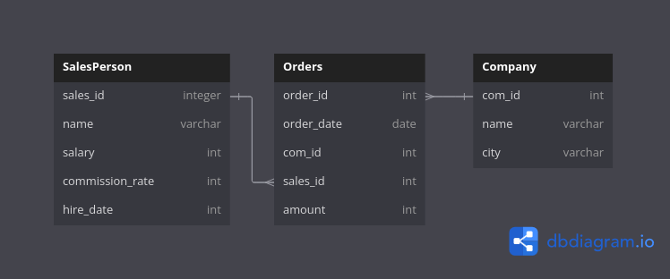
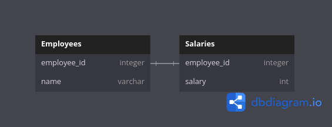
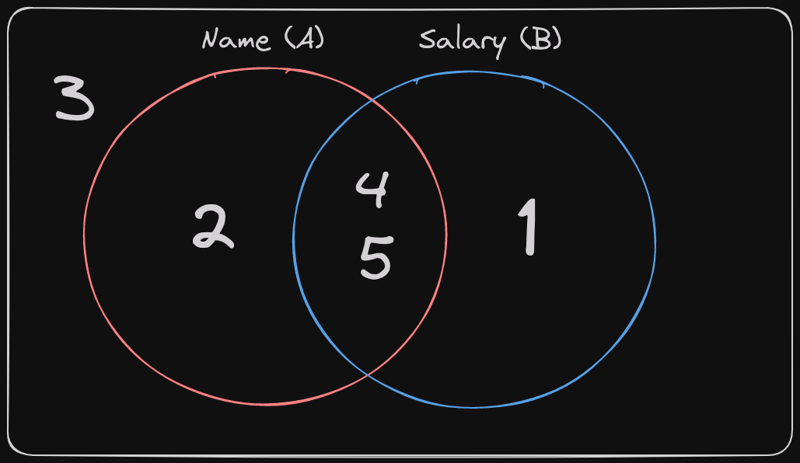

# Overview

As I've been studying more SQL lately I figured this would be a good excuse to chronicle some of the more interesting problems. May as well get something out of doing the work.

# Leetcode Database Problem 607: Sales Person

[Link to the problem here](https://leetcode.com/problems/sales-person/description/)

This is the question that prompted this blog post as it was pretty fun to wrestle with. 

This problem gives us the following db schema:



The example input is as such:

## Example Tables

### SalesPerson table:

| sales_id | name | salary | commission_rate | hire_date  |
|----------|------|--------|-----------------|------------|
| 1        | John | 100000 | 6               | 4/1/2006   |
| 2        | Amy  | 12000  | 5               | 5/1/2010   |
| 3        | Mark | 65000  | 12              | 12/25/2008 |
| 4        | Pam  | 25000  | 25              | 1/1/2005   |
| 5        | Alex | 5000   | 10              | 2/3/2007   |

### Company table:

| com_id | name   | city     |
|--------|--------|----------|
| 1      | RED    | Boston   |
| 2      | ORANGE | New York |
| 3      | YELLOW | Boston   |
| 4      | GREEN  | Austin   |

### Orders table:

| order_id | order_date | com_id | sales_id | amount |
|----------|------------|--------|----------|--------|
| 1        | 1/1/2014   | 3      | 4        | 10000  |
| 2        | 2/1/2014   | 4      | 5        | 5000   |
| 3        | 3/1/2014   | 1      | 1        | 50000  |
| 4        | 4/1/2014   | 1      | 4        | 25000  |

## The Problem

We're tasked with finding the names of all the salespersons who did not have any orders related to the company with the name "RED". 

## The Solution

Seems simple enough. It's important to note that we have a LOT of information that won't be relevant here. A lot of this is just here to confuse you. The big thing with these database leetcode problems is honing in on the few columns we actually care about.

My goal here is to break problems this into two key steps.

1. Get a list of the `sales_id` values that have an order associated with the company "RED". 
2. Set up my main query to exclude any sales persons with a `sales_id` in that list.

What this means is that we have two queries here, an inner and an outer one. Fun! 

### Inner Query

Setting up this inner query involves joining the `Orders` and `Company` tables together. We're looking for any orders where the company id links to the company name being "RED". Since we're interested in getting additional information on the Orders table this will be a left join smushing the company table onto orders.

```
SELECT o.sales_id
FROM Orders o
LEFT JOIN Company c ON o.com_id = c.com_id
WHERE c.name LIKE '%red%'
```

This provides us a list of all the sales ids connected to the company Red! So now we can use this list in our outer query.

### Outer Query

This ones super simple. We just want the names of salespersons that are not in that list we just made. This is the easy part.

```
SELECT s.name
FROM SalesPerson s
WHERE s.sales_id NOT IN (
    # Creates list of sales_id associated with company "Red"
    SELECT o.sales_id
    FROM Orders o
    LEFT JOIN company c ON o.com_id = c.com_id
    WHERE c.name LIKE 'RED'
)
```

And that's it! Not too bad. I'm still trying to build up intuition for nested queries so I wanted to save this one. I've got a LOT of SQL leetcode to go so I'll be progressively adding to this post over time.

# Leetcode Database Problem 1965: Employees With Missing Information

[Link to the problem here](https://leetcode.com/problems/employees-with-missing-information/description/)

This data has such a simple schema I think it's really only two tables for the sake of fabricating this problem.



## Example Tables

### Employees table:

| employee_id | name     |
|-------------|----------|
| 2           | Crew     |
| 4           | Haven    |
| 5           | Kristian |

### Salaries table:

| employee_id | salary |
|-------------|--------|
| 5           | 76071  |
| 1           | 22517  |
| 4           | 63539  |

### Output:

| employee_id |
|-------------|
| 1           |
| 2           |

### Explanation:

Employees 1, 2, 4, and 5 are working at this company.
- The name of employee 1 is missing.
- The salary of employee 2 is missing.

## The Problem

The goal here is to return the IDs of any employees with any missing information. That is, those missing salary info or names. The IDs must be ordered in ascending order.

This seems fairly straightforward on its own but actually gets kind of weird. Let's dive in.

## The Solution

My solution here feels a little unorthodox. I tried poking around a variety of solutions but ended up back at the whiteboard pondering exactly what it was that I wanted. In the end, as is often the case in SQL, set theory saved me.

### Set Visualizing

Let's expand out these tables to include the employees that they're missing.

| employee_id | name     |
|-------------|----------|
| 2           | Crew     |
| 4           | Haven    |
| 5           | Kristian |
| 1           | null     |
| 3           | null     |

| employee_id | salary |
|-------------|--------|
| 5           | 76071  |
| 1           | 22517  |
| 4           | 63539  |
| 2           | null   |
| 3           | null   |

1 and 3 are missing from `Employees`, 2 and 3 are missing from `Salaries`. Okay, cool. What does that give us? Let's try visualizing this in a slightly different way.



What we want is the area containing 2 AND the area containing 1. That's because only the portion in the middle has both name and salary information. In set theory notation this is:

$$(A-B) \cup (B-A)$$

Thankfully, SQL has the `except` and `union` operators so we can easily build this! Of note that, based on my interpretation of the example output, Employee 3 is in neither table so does not exist. I included 3 in here purely because it was a part of my problem solving.

### The Code

```
# This chunk is (A-B)
(
    SELECT employee_id
    FROM salaries
    EXCEPT
    SELECT employee_id
    FROM employees
)

UNION

# And this is (B-A)
(
    SELECT employee_id
    FROM employees
    EXCEPT
    SELECT employee_id
    FROM salaries
)
ORDER BY employee_id
```

This seems like pretty smelly code not gonna lie. However this is an arbitrary weird problem set so I don't feel too bad. There are plenty of other solutions posted on leetcode but this is the one I organically reached and thought it was fun to solve so here we are! 